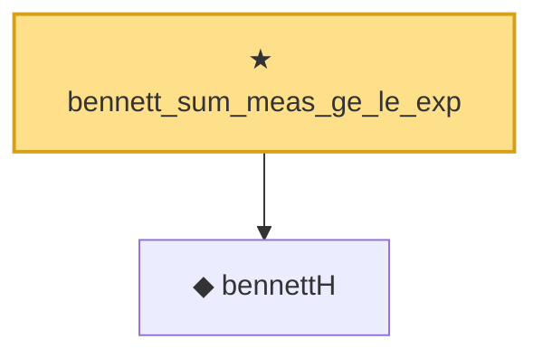

# Proof narrative — bennett_sum_meas_ge_le_exp

Root: **bennett_sum_meas_ge_le_exp** (theorem) `Statlib/StatFoundation/Concentration/ExponentialType/bennett_sum_meas_ge_le_exp.lean:10` · topic `StatFoundation`
Closure: 2 declarations across 1 files. Generated from `proof_graph.json` — no files were moved.

Reading order (foundations first, headline last):

  ◆ `bennettH` — noncomputable def · `Statlib/StatFoundation/Concentration/ExponentialType/bennett_sum_meas_ge_le_exp.lean:7`
★ `bennett_sum_meas_ge_le_exp` — theorem · `Statlib/StatFoundation/Concentration/ExponentialType/bennett_sum_meas_ge_le_exp.lean:10` **← headline**

## Dependency diagram

