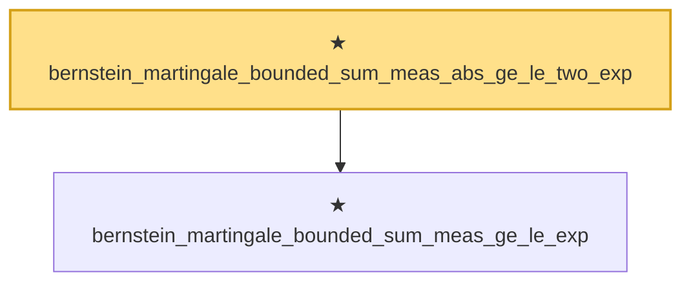

# Proof narrative — bernstein_martingale_bounded_sum_meas_abs_ge_le_two_exp

Root: **bernstein_martingale_bounded_sum_meas_abs_ge_le_two_exp** (theorem) `Statlib/StatFoundation/Concentration/ExponentialType/bernstein_martingale_bounded_sum_meas_abs_ge_le_two_exp.lean:15` · topic `StatFoundation`
Closure: 2 declarations across 2 files. Generated from `proof_graph.json` — no files were moved.

Reading order (foundations first, headline last):

  ★ `bernstein_martingale_bounded_sum_meas_ge_le_exp` — theorem · `Statlib/StatFoundation/Concentration/ExponentialType/bernstein_martingale_bounded_sum_meas_ge_le_exp.lean:14`
★ `bernstein_martingale_bounded_sum_meas_abs_ge_le_two_exp` — theorem · `Statlib/StatFoundation/Concentration/ExponentialType/bernstein_martingale_bounded_sum_meas_abs_ge_le_two_exp.lean:15` **← headline**

## Dependency diagram

