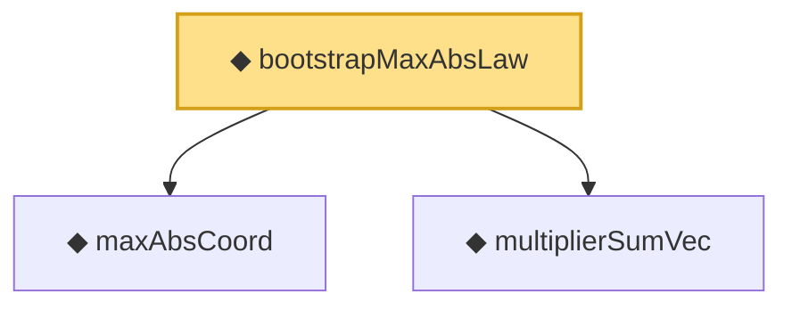

# Proof narrative — bootstrapMaxAbsLaw

Root: **bootstrapMaxAbsLaw** (noncomputable def) `Statlib/StatFoundation/Vocabulary/Resampling.lean:70` · topic `StatFoundation`
Closure: 3 declarations across 2 files. Generated from `proof_graph.json` — no files were moved.

Reading order (foundations first, headline last):

  ◆ `maxAbsCoord` — noncomputable def · `Statlib/StatFoundation/Vocabulary/MaxType.lean:39`  _(also used by 5: maxAbsCoord_measurable, maxAbsCoord_lipschitz, tendstoInDistribution_maxAbsCoord_of_tendstoInDistribution, …)_
  ◆ `multiplierSumVec` — noncomputable def · `Statlib/StatFoundation/Vocabulary/Resampling.lean:55`  _(also used by 6: bootstrapMaxLaw_isProbabilityMeasure, multiplierSumVec_mean_zero, multiplierSumVec_covariance_eq_sampleGram, …)_
◆ `bootstrapMaxAbsLaw` — noncomputable def · `Statlib/StatFoundation/Vocabulary/Resampling.lean:70` **← headline**

## Dependency diagram

