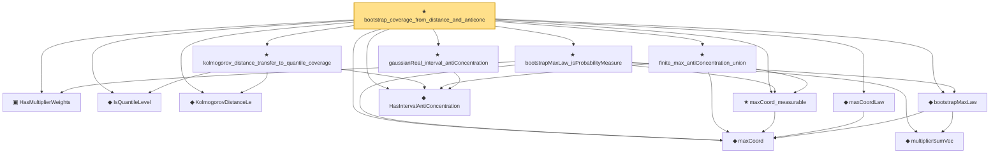

# Proof narrative — bootstrap_coverage_from_distance_and_anticonc

Root: **bootstrap_coverage_from_distance_and_anticonc** (theorem) `Statlib/StatFoundation/Convergence/Resampling/BootstrapInterface.lean:143` · topic `StatFoundation`
Closure: 14 declarations across 5 files. Generated from `proof_graph.json` — no files were moved.

Reading order (foundations first, headline last):

  ▣ `HasMultiplierWeights` — structure · `Statlib/StatFoundation/Vocabulary/Resampling.lean:44`  _(also used by 4: multiplierSumVec_mean_zero, multiplierSumVec_covariance_eq_sampleGram, variance_linearFunctional, …)_
  ◆ `IsQuantileLevel` — def · `Statlib/StatFoundation/Vocabulary/MaxType.lean:61`  _(also used by 1: IsBootstrapCriticalValue)_
  ◆ `KolmogorovDistanceLe` — def · `Statlib/StatFoundation/Vocabulary/MaxType.lean:56`
  ◆ `maxCoord` — noncomputable def · `Statlib/StatFoundation/Vocabulary/MaxType.lean:34`  _(also used by 7: smoothMax_bounds_max_log_card, maxCoord_lipschitz, maxCoord_lipschitz_ineq, …)_
    ◆ `multiplierSumVec` — noncomputable def · `Statlib/StatFoundation/Vocabulary/Resampling.lean:55`  _(also used by 5: multiplierSumVec_mean_zero, multiplierSumVec_covariance_eq_sampleGram, variance_linearFunctional, …)_
  ◆ `bootstrapMaxLaw` — noncomputable def · `Statlib/StatFoundation/Vocabulary/Resampling.lean:64`
  ◆ `maxCoordLaw` — noncomputable abbrev · `Statlib/StatFoundation/Vocabulary/MaxType.lean:45`  _(also used by 1: gaussianMax_nazarov_anticoncentration_interface)_
  ◆ `HasIntervalAntiConcentration` — def · `Statlib/StatFoundation/Vocabulary/Resampling.lean:36`  _(also used by 2: maxLaw_CDF_bound_of_coordinatewise_proximity, gaussianMax_nazarov_anticoncentration_interface)_
  ★ `gaussianReal_interval_antiConcentration` — theorem · `Statlib/StatFoundation/Convergence/Resampling/AntiConcentration.lean:22`  _(also used by 1: gaussianMax_nazarov_anticoncentration_interface)_
  ★ `maxCoord_measurable` — theorem · `Statlib/StatFoundation/Convergence/CentralLimitTheorem/MaxType.lean:29`  _(also used by 1: maxLaw_CDF_bound_of_coordinatewise_proximity)_
  ★ `finite_max_antiConcentration_union` — theorem · `Statlib/StatFoundation/Convergence/Resampling/AntiConcentration.lean:67`  _(also used by 1: gaussianMax_nazarov_anticoncentration_interface)_
  ★ `bootstrapMaxLaw_isProbabilityMeasure` — theorem · `Statlib/StatFoundation/Convergence/Resampling/BootstrapInterface.lean:52`
  ★ `kolmogorov_distance_transfer_to_quantile_coverage` — theorem · `Statlib/StatFoundation/Convergence/Resampling/BootstrapInterface.lean:74`
★ `bootstrap_coverage_from_distance_and_anticonc` — theorem · `Statlib/StatFoundation/Convergence/Resampling/BootstrapInterface.lean:143` **← headline**

## Dependency diagram

