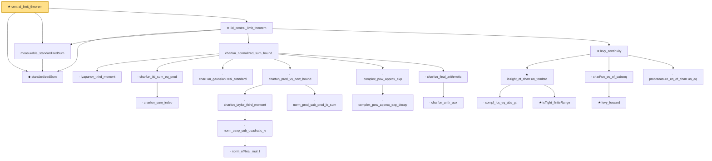

# Proof narrative — central_limit_theorem

Root: **central_limit_theorem** (theorem) `Statlib/StatFoundation/Convergence/CentralLimitTheorem/IID.lean:96` · topic `StatFoundation`
Closure: 25 declarations across 4 files. Generated from `proof_graph.json` — no files were moved.

Reading order (foundations first, headline last):

  ◆ `standardizedSum` — abbrev · `Statlib/StatFoundation/Convergence/CentralLimitTheorem/IID.lean:21`  _(also used by 1: Sn)_
  · `measurable_standardizedSum` — lemma · `Statlib/StatFoundation/Convergence/CentralLimitTheorem/IID.lean:24`  _(also used by 1: measurable_Sn)_
      · `lyapunov_third_moment` — lemma · `Statlib/StatFoundation/Convergence/AnalysisTools/CharacteristicFunction.lean:563`
        · `charfun_sum_indep` — lemma · `Statlib/StatFoundation/Convergence/AnalysisTools/CharacteristicFunction.lean:282`
      · `charfun_iid_sum_eq_prod` — lemma · `Statlib/StatFoundation/Convergence/AnalysisTools/CharacteristicFunction.lean:323`
      · `charFun_gaussianReal_standard` — lemma · `Statlib/StatFoundation/Convergence/AnalysisTools/CharacteristicFunction.lean:272`  _(also used by 1: lindeberg_feller_central_limit_theorem)_
            · `norm_ofReal_mul_I` — lemma · `Statlib/StatFoundation/Convergence/AnalysisTools/CharacteristicFunction.lean:16`  _(also used by 1: norm_cexp_sub_quadratic_le_third)_
          · `norm_cexp_sub_quadratic_le` — lemma · `Statlib/StatFoundation/Convergence/AnalysisTools/CharacteristicFunction.lean:22`  _(also used by 2: norm_cexp_sub_quadratic_le_sq, charfun_error_le_j)_
        · `charfun_taylor_third_moment` — lemma · `Statlib/StatFoundation/Convergence/AnalysisTools/CharacteristicFunction.lean:86`
        · `norm_prod_sub_prod_le_sum` — lemma · `Statlib/StatFoundation/Convergence/AnalysisTools/CharacteristicFunction.lean:187`
      · `charfun_prod_vs_pow_bound` — lemma · `Statlib/StatFoundation/Convergence/AnalysisTools/CharacteristicFunction.lean:419`
        · `complex_pow_approx_exp_decay` — lemma · `Statlib/StatFoundation/Convergence/AnalysisTools/CharacteristicFunction.lean:350`
      · `complex_pow_approx_exp` — lemma · `Statlib/StatFoundation/Convergence/AnalysisTools/CharacteristicFunction.lean:401`
        · `charfun_arith_aux` — lemma · `Statlib/StatFoundation/Convergence/AnalysisTools/CharacteristicFunction.lean:486`
      · `charfun_final_arithmetic` — lemma · `Statlib/StatFoundation/Convergence/AnalysisTools/CharacteristicFunction.lean:510`
    · `charfun_normalized_sum_bound` — lemma · `Statlib/StatFoundation/Convergence/AnalysisTools/CharacteristicFunction.lean:612`
        · `compl_Icc_eq_abs_gt` — lemma · `Statlib/StatFoundation/Convergence/AnalysisTools/LevyContinuity.lean:15`
        ★ `isTight_finiteRange` — theorem · `Statlib/StatFoundation/Convergence/AnalysisTools/Tightness.lean:14`
      ★ `isTight_of_charFun_tendsto` — theorem · `Statlib/StatFoundation/Convergence/AnalysisTools/LevyContinuity.lean:44`  _(also used by 1: isTight_of_charFun_tendsto_inner)_
        ★ `levy_forward` — theorem · `Statlib/StatFoundation/Convergence/AnalysisTools/LevyContinuity.lean:31`  _(also used by 1: cramer_wold_reverse)_
      · `charFun_eq_of_subseq` — lemma · `Statlib/StatFoundation/Convergence/AnalysisTools/LevyContinuity.lean:168`
      · `probMeasure_eq_of_charFun_eq` — lemma · `Statlib/StatFoundation/Convergence/AnalysisTools/LevyContinuity.lean:180`
    ★ `levy_continuity` — theorem · `Statlib/StatFoundation/Convergence/AnalysisTools/LevyContinuity.lean:193`  _(also used by 1: lindeberg_feller_central_limit_theorem)_
  ★ `iid_central_limit_theorem` — theorem · `Statlib/StatFoundation/Convergence/CentralLimitTheorem/IID.lean:42`  _(also used by 1: multivariate_central_limit_theorem)_
★ `central_limit_theorem` — theorem · `Statlib/StatFoundation/Convergence/CentralLimitTheorem/IID.lean:96` **← headline**

## Dependency diagram

