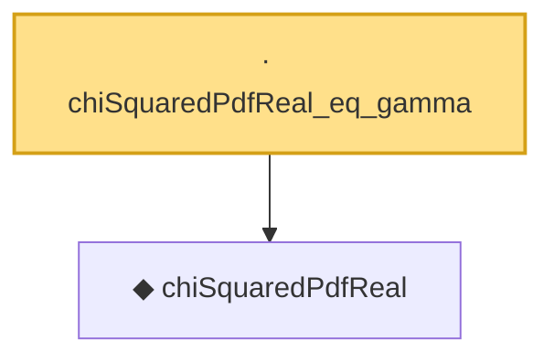

# Proof narrative — chiSquaredPdfReal_eq_gamma

Root: **chiSquaredPdfReal_eq_gamma** (lemma) `Statlib/StatFoundation/Probability/ChiSquared.lean:33` · topic `StatFoundation`
Closure: 2 declarations across 1 files. Generated from `proof_graph.json` — no files were moved.

Reading order (foundations first, headline last):

  ◆ `chiSquaredPdfReal` — noncomputable def · `Statlib/StatFoundation/Probability/ChiSquared.lean:28`
· `chiSquaredPdfReal_eq_gamma` — lemma · `Statlib/StatFoundation/Probability/ChiSquared.lean:33` **← headline**

## Dependency diagram

