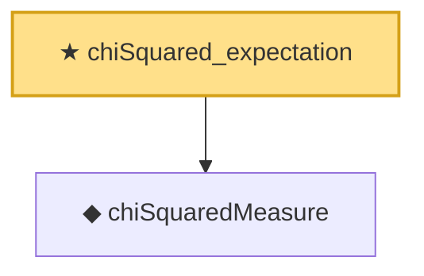

# Proof narrative — chiSquared_expectation

Root: **chiSquared_expectation** (theorem) `Statlib/StatFoundation/Probability/ChiSquared.lean:51` · topic `StatFoundation`
Closure: 2 declarations across 1 files. Generated from `proof_graph.json` — no files were moved.

Reading order (foundations first, headline last):

  ◆ `chiSquaredMeasure` — noncomputable def · `Statlib/StatFoundation/Probability/ChiSquared.lean:22`  _(also used by 13: single_square_law, wald_statistic_asymptotic_chisq1, score_statistic_asymptotic_chisq1, …)_
★ `chiSquared_expectation` — theorem · `Statlib/StatFoundation/Probability/ChiSquared.lean:51` **← headline**

## Dependency diagram

