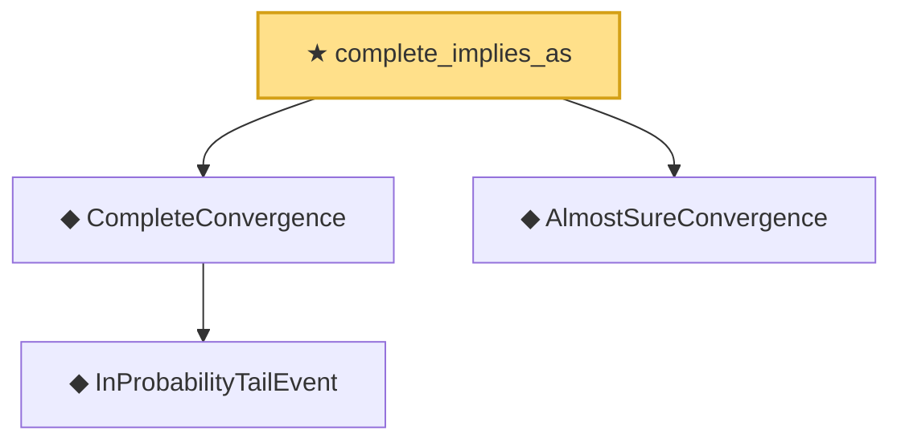

# Proof narrative — complete_implies_as

Root: **complete_implies_as** (theorem) `Statlib/StatFoundation/Convergence/AnalysisTools/ConvergenceModes.lean:225` · topic `StatFoundation`
Closure: 4 declarations across 1 files. Generated from `proof_graph.json` — no files were moved.

Reading order (foundations first, headline last):

    ◆ `InProbabilityTailEvent` — def · `Statlib/StatFoundation/Convergence/AnalysisTools/ConvergenceModes.lean:46`  _(also used by 2: InProbabilityConvergence, as_implies_inProbability)_
  ◆ `CompleteConvergence` — def · `Statlib/StatFoundation/Convergence/AnalysisTools/ConvergenceModes.lean:97`
  ◆ `AlmostSureConvergence` — def · `Statlib/StatFoundation/Convergence/AnalysisTools/ConvergenceModes.lean:35`  _(also used by 2: as_implies_inProbability, inProbability_implies_subseq_as)_
★ `complete_implies_as` — theorem · `Statlib/StatFoundation/Convergence/AnalysisTools/ConvergenceModes.lean:225` **← headline**

## Dependency diagram

