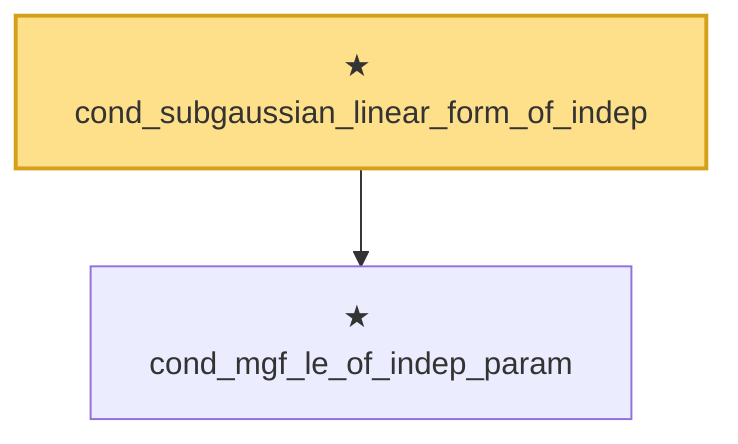

# Proof narrative — cond_subgaussian_linear_form_of_indep

Root: **cond_subgaussian_linear_form_of_indep** (theorem) `Statlib/StatFoundation/RandomVariable/SubGaussian/cond_subgaussian_linear_form_of_indep.lean:23` · topic `StatFoundation`
Closure: 2 declarations across 2 files. Generated from `proof_graph.json` — no files were moved.

Reading order (foundations first, headline last):

  ★ `cond_mgf_le_of_indep_param` — theorem · `Statlib/StatFoundation/Probability/CondMgfFreezing.lean:24`
★ `cond_subgaussian_linear_form_of_indep` — theorem · `Statlib/StatFoundation/RandomVariable/SubGaussian/cond_subgaussian_linear_form_of_indep.lean:23` **← headline**

## Dependency diagram

