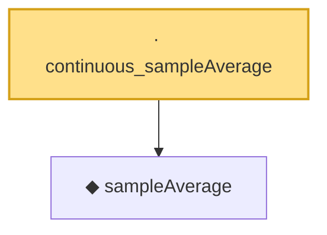

# Proof narrative — continuous_sampleAverage

Root: **continuous_sampleAverage** (lemma) `Statlib/StatFoundation/Convergence/LawOfLargeNumbers/UniformStrongLaw.lean:45` · topic `StatFoundation`
Closure: 2 declarations across 1 files. Generated from `proof_graph.json` — no files were moved.

Reading order (foundations first, headline last):

  ◆ `sampleAverage` — noncomputable def · `Statlib/StatFoundation/Convergence/LawOfLargeNumbers/UniformStrongLaw.lean:20`  _(also used by 3: strong_law_sampleAverage_pointwise, strong_law_sampleAverage_finset_ae, uniform_strong_law)_
· `continuous_sampleAverage` — lemma · `Statlib/StatFoundation/Convergence/LawOfLargeNumbers/UniformStrongLaw.lean:45` **← headline**

## Dependency diagram

