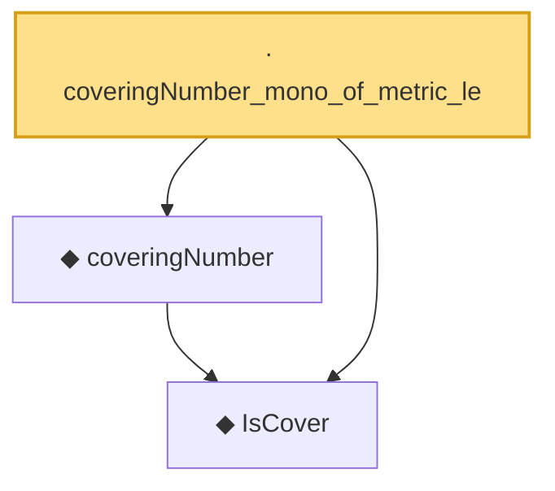

# Proof narrative — coveringNumber_mono_of_metric_le

Root: **coveringNumber_mono_of_metric_le** (lemma) `Statlib/StatFoundation/Vocabulary/CoveringNumbers.lean:146` · topic `StatFoundation`
Closure: 3 declarations across 1 files. Generated from `proof_graph.json` — no files were moved.

Reading order (foundations first, headline last):

  ◆ `IsCover` — def · `Statlib/StatFoundation/Vocabulary/CoveringNumbers.lean:75`  _(also used by 11: rkhsBall_exists_sup_cover_le_of_domainCover, rkhsBall_coveringNumber_le_of_domainCover, rkhsBall_coveringNumber_le_of_L2_internal, …)_
  ◆ `coveringNumber` — noncomputable def · `Statlib/StatFoundation/Vocabulary/CoveringNumbers.lean:81`  _(also used by 10: rkhsBall_coveringNumber_le_of_domainCover, rkhsBall_coveringNumber_le_of_L2_internal, rkhsBall_logEntropy_L2_le, …)_
· `coveringNumber_mono_of_metric_le` — lemma · `Statlib/StatFoundation/Vocabulary/CoveringNumbers.lean:146` **← headline**

## Dependency diagram

