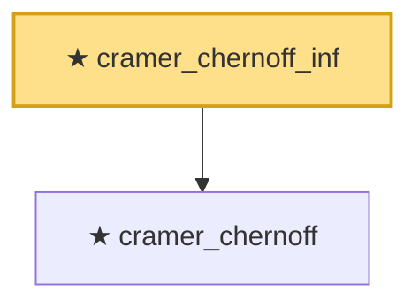

# Proof narrative — cramer_chernoff_inf

Root: **cramer_chernoff_inf** (theorem) `Statlib/StatFoundation/Concentration/MomentType/cramer_chernoff.lean:69` · topic `StatFoundation`
Closure: 2 declarations across 1 files. Generated from `proof_graph.json` — no files were moved.

Reading order (foundations first, headline last):

  ★ `cramer_chernoff` — theorem · `Statlib/StatFoundation/Concentration/MomentType/cramer_chernoff.lean:9`
★ `cramer_chernoff_inf` — theorem · `Statlib/StatFoundation/Concentration/MomentType/cramer_chernoff.lean:69` **← headline**

## Dependency diagram

