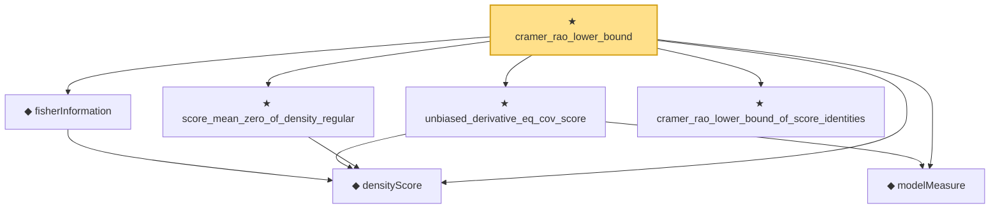

# Proof narrative — cramer_rao_lower_bound

Root: **cramer_rao_lower_bound** (theorem) `Statlib/StatFoundation/Statistics/Estimation/CramerRao.lean:273` · topic `StatFoundation`
Closure: 7 declarations across 2 files. Generated from `proof_graph.json` — no files were moved.

Reading order (foundations first, headline last):

  ◆ `densityScore` — noncomputable def · `Statlib/StatFoundation/Statistics/Estimation/Vocabulary.lean:64`  _(also used by 5: fisher_identity_of_second_derivative, mle_asymptotic_normal, directionScoreInformationIdentity, …)_
  ◆ `modelMeasure` — noncomputable def · `Statlib/StatFoundation/Statistics/Estimation/Vocabulary.lean:87`  _(also used by 1: unbiased_derivative_eq_cov_score_vec)_
  ◆ `fisherInformation` — noncomputable def · `Statlib/StatFoundation/Statistics/Estimation/Vocabulary.lean:72`  _(also used by 3: fisher_identity_of_second_derivative, mle_asymptotic_normal, directionScoreInformationIdentity)_
  ★ `unbiased_derivative_eq_cov_score` — theorem · `Statlib/StatFoundation/Statistics/Estimation/CramerRao.lean:114`  _(also used by 1: unbiased_derivative_eq_cov_score_vec)_
  ★ `score_mean_zero_of_density_regular` — theorem · `Statlib/StatFoundation/Statistics/Estimation/CramerRao.lean:72`  _(also used by 2: mle_asymptotic_normal, score_mean_zero_vec)_
  ★ `cramer_rao_lower_bound_of_score_identities` — theorem · `Statlib/StatFoundation/Statistics/Estimation/CramerRao.lean:29`
★ `cramer_rao_lower_bound` — theorem · `Statlib/StatFoundation/Statistics/Estimation/CramerRao.lean:273` **← headline**

## Dependency diagram

