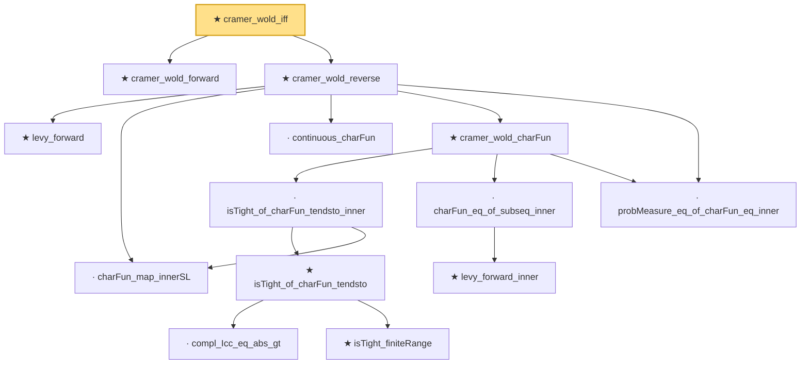

# Proof narrative — cramer_wold_iff

Root: **cramer_wold_iff** (theorem) `Statlib/StatFoundation/Convergence/AnalysisTools/CramerWold.lean:324` · topic `StatFoundation`
Closure: 14 declarations across 3 files. Generated from `proof_graph.json` — no files were moved.

Reading order (foundations first, headline last):

  ★ `cramer_wold_forward` — theorem · `Statlib/StatFoundation/Convergence/AnalysisTools/CramerWold.lean:74`
    ★ `levy_forward` — theorem · `Statlib/StatFoundation/Convergence/AnalysisTools/LevyContinuity.lean:31`  _(also used by 1: charFun_eq_of_subseq)_
    · `charFun_map_innerSL` — lemma · `Statlib/StatFoundation/Convergence/AnalysisTools/CramerWold.lean:17`
    · `continuous_charFun` — lemma · `Statlib/StatFoundation/Convergence/AnalysisTools/CramerWold.lean:33`
          · `compl_Icc_eq_abs_gt` — lemma · `Statlib/StatFoundation/Convergence/AnalysisTools/LevyContinuity.lean:15`
          ★ `isTight_finiteRange` — theorem · `Statlib/StatFoundation/Convergence/AnalysisTools/Tightness.lean:14`
        ★ `isTight_of_charFun_tendsto` — theorem · `Statlib/StatFoundation/Convergence/AnalysisTools/LevyContinuity.lean:44`  _(also used by 1: levy_continuity)_
      · `isTight_of_charFun_tendsto_inner` — lemma · `Statlib/StatFoundation/Convergence/AnalysisTools/CramerWold.lean:123`
        ★ `levy_forward_inner` — theorem · `Statlib/StatFoundation/Convergence/AnalysisTools/CramerWold.lean:55`
      · `charFun_eq_of_subseq_inner` — lemma · `Statlib/StatFoundation/Convergence/AnalysisTools/CramerWold.lean:92`
    · `probMeasure_eq_of_charFun_eq_inner` — lemma · `Statlib/StatFoundation/Convergence/AnalysisTools/CramerWold.lean:107`
    ★ `cramer_wold_charFun` — theorem · `Statlib/StatFoundation/Convergence/AnalysisTools/CramerWold.lean:253`
  ★ `cramer_wold_reverse` — theorem · `Statlib/StatFoundation/Convergence/AnalysisTools/CramerWold.lean:289`
★ `cramer_wold_iff` — theorem · `Statlib/StatFoundation/Convergence/AnalysisTools/CramerWold.lean:324` **← headline**

## Dependency diagram

