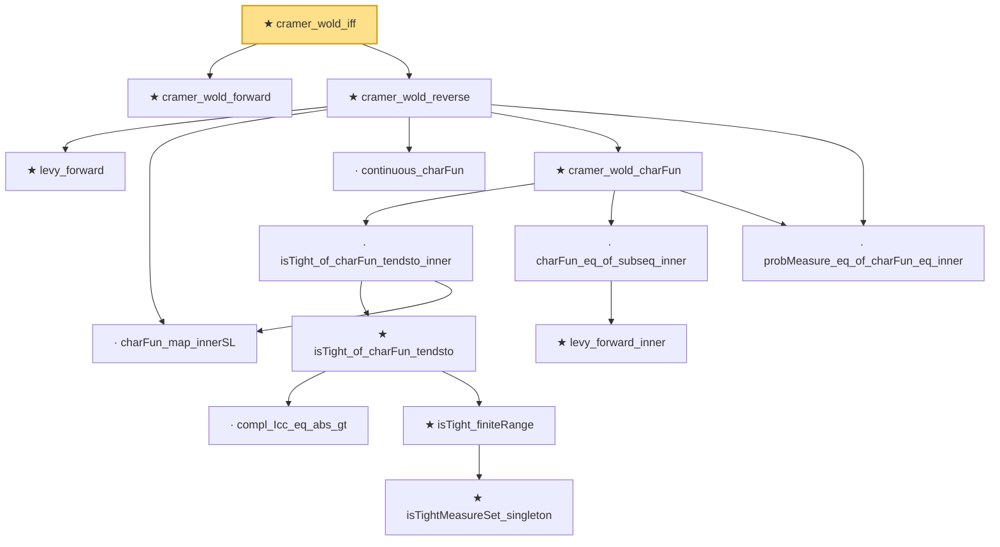

# Proof narrative — cramer_wold_iff

Root: **cramer_wold_iff** (theorem) `Statlib/StatFoundation/Convergence/AnalysisTools/CramerWold.lean:332` · topic `StatFoundation`
Closure: 15 declarations across 3 files. Generated from `proof_graph.json` — no files were moved.

Reading order (foundations first, headline last):

  ★ `cramer_wold_forward` — theorem · `Statlib/StatFoundation/Convergence/AnalysisTools/CramerWold.lean:80`
    ★ `levy_forward` — theorem · `Statlib/StatFoundation/Convergence/AnalysisTools/LevyContinuity.lean:31`  _(also used by 1: charFun_eq_of_subseq)_
    · `charFun_map_innerSL` — lemma · `Statlib/StatFoundation/Convergence/AnalysisTools/CramerWold.lean:22`
    · `continuous_charFun` — lemma · `Statlib/StatFoundation/Convergence/AnalysisTools/CramerWold.lean:39`
          · `compl_Icc_eq_abs_gt` — lemma · `Statlib/StatFoundation/Convergence/AnalysisTools/LevyContinuity.lean:15`
            ★ `isTightMeasureSet_singleton` — theorem · `Statlib/StatFoundation/Convergence/AnalysisTools/Tightness.lean:113`  _(also used by 1: isTightMeasureSet_finiteRange)_
          ★ `isTight_finiteRange` — theorem · `Statlib/StatFoundation/Convergence/AnalysisTools/Tightness.lean:18`  _(also used by 1: isTightMeasureSet_range_map_of_isBigOInProbability_one_real)_
        ★ `isTight_of_charFun_tendsto` — theorem · `Statlib/StatFoundation/Convergence/AnalysisTools/LevyContinuity.lean:44`  _(also used by 1: levy_continuity)_
      · `isTight_of_charFun_tendsto_inner` — lemma · `Statlib/StatFoundation/Convergence/AnalysisTools/CramerWold.lean:131`
        ★ `levy_forward_inner` — theorem · `Statlib/StatFoundation/Convergence/AnalysisTools/CramerWold.lean:61`
      · `charFun_eq_of_subseq_inner` — lemma · `Statlib/StatFoundation/Convergence/AnalysisTools/CramerWold.lean:99`
    · `probMeasure_eq_of_charFun_eq_inner` — lemma · `Statlib/StatFoundation/Convergence/AnalysisTools/CramerWold.lean:114`
    ★ `cramer_wold_charFun` — theorem · `Statlib/StatFoundation/Convergence/AnalysisTools/CramerWold.lean:261`
  ★ `cramer_wold_reverse` — theorem · `Statlib/StatFoundation/Convergence/AnalysisTools/CramerWold.lean:297`  _(also used by 1: tendstoInDistribution_of_forall_inner_real)_
★ `cramer_wold_iff` — theorem · `Statlib/StatFoundation/Convergence/AnalysisTools/CramerWold.lean:332` **← headline**

## Dependency diagram

```mermaid
flowchart TD
  n0["★ cramer_wold_forward"]
  n1["★ levy_forward"]
  n2["· charFun_map_innerSL"]
  n3["· continuous_charFun"]
  n4["· compl_Icc_eq_abs_gt"]
  n5["★ isTightMeasureSet_singleton"]
  n6["★ isTight_finiteRange"]
  n7["★ isTight_of_charFun_tendsto"]
  n8["· isTight_of_charFun_tendsto_inner"]
  n9["★ levy_forward_inner"]
  n10["· charFun_eq_of_subseq_inner"]
  n11["· probMeasure_eq_of_charFun_eq_inner"]
  n12["★ cramer_wold_charFun"]
  n13["★ cramer_wold_reverse"]
  n14["★ cramer_wold_iff"]
  n6 --> n5
  n7 --> n4
  n7 --> n6
  n8 --> n7
  n8 --> n2
  n10 --> n9
  n12 --> n8
  n12 --> n10
  n12 --> n11
  n13 --> n1
  n13 --> n2
  n13 --> n3
  n13 --> n12
  n13 --> n11
  n14 --> n0
  n14 --> n13
  class n14 headline;
  classDef headline fill:#ffe08a,stroke:#d4a017,stroke-width:2px;
  classDef axiomNode fill:#ffd0d0,stroke:#c0392b,stroke-dasharray:4 2;
```
