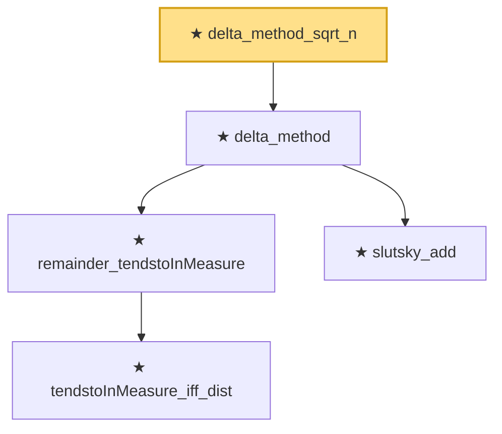

# Proof narrative — delta_method_sqrt_n

Root: **delta_method_sqrt_n** (theorem) `Statlib/StatFoundation/Convergence/AnalysisTools/MappingTheorems.lean:431` · topic `StatFoundation`
Closure: 5 declarations across 2 files. Generated from `proof_graph.json` — no files were moved.

Reading order (foundations first, headline last):

      ★ `tendstoInMeasure_iff_dist` — theorem · `Statlib/StatFoundation/Convergence/AnalysisTools/ConvergenceModes.lean:574`  _(also used by 5: tendstoInMeasure_of_inProbabilityConvergence, tendstoInMeasure_lipschitz, tendstoInMeasure_inv_of_ne_zero, …)_
    ★ `remainder_tendstoInMeasure` — theorem · `Statlib/StatFoundation/Convergence/AnalysisTools/MappingTheorems.lean:273`
    ★ `slutsky_add` — theorem · `Statlib/StatFoundation/Convergence/AnalysisTools/MappingTheorems.lean:23`
  ★ `delta_method` — theorem · `Statlib/StatFoundation/Convergence/AnalysisTools/MappingTheorems.lean:386`
★ `delta_method_sqrt_n` — theorem · `Statlib/StatFoundation/Convergence/AnalysisTools/MappingTheorems.lean:431` **← headline**

## Dependency diagram

