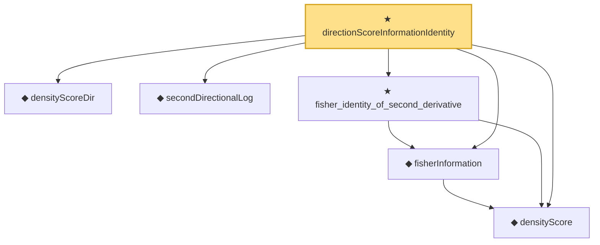

# Proof narrative — directionScoreInformationIdentity

Root: **directionScoreInformationIdentity** (theorem) `Statlib/StatFoundation/Statistics/Estimation/MultiParameter.lean:272` · topic `StatFoundation`
Closure: 6 declarations across 3 files. Generated from `proof_graph.json` — no files were moved.

Reading order (foundations first, headline last):

  ◆ `densityScoreDir` — noncomputable def · `Statlib/StatFoundation/Statistics/Estimation/Vocabulary.lean:221`
  ◆ `secondDirectionalLog` — noncomputable def · `Statlib/StatFoundation/Statistics/Estimation/Vocabulary.lean:229`
  ◆ `densityScore` — noncomputable def · `Statlib/StatFoundation/Statistics/Estimation/Vocabulary.lean:64`  _(also used by 6: score_mean_zero_of_density_regular, unbiased_derivative_eq_cov_score, cramer_rao_lower_bound, …)_
  ◆ `fisherInformation` — noncomputable def · `Statlib/StatFoundation/Statistics/Estimation/Vocabulary.lean:72`  _(also used by 2: cramer_rao_lower_bound, mle_asymptotic_normal)_
  ★ `fisher_identity_of_second_derivative` — theorem · `Statlib/StatFoundation/Statistics/Estimation/MLE.lean:39`  _(also used by 1: mle_asymptotic_normal)_
★ `directionScoreInformationIdentity` — theorem · `Statlib/StatFoundation/Statistics/Estimation/MultiParameter.lean:272` **← headline**

## Dependency diagram

