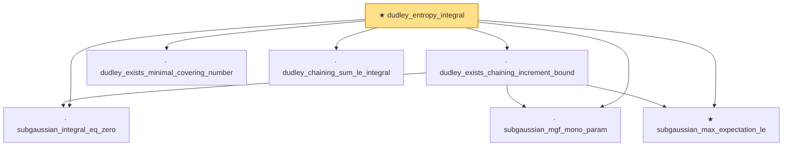

# Proof narrative — dudley_entropy_integral

Root: **dudley_entropy_integral** (theorem) `Statlib/StatFoundation/EmpiricalProcess/DudleyEntropyIntegral.lean:989` · topic `StatFoundation`
Closure: 7 declarations across 4 files. Generated from `proof_graph.json` — no files were moved.

Reading order (foundations first, headline last):

  · `subgaussian_integral_eq_zero` — lemma · `Statlib/StatFoundation/RandomVariable/SubGaussian/subgaussian_integral_eq_zero.lean:12`  _(also used by 3: cov_trace_concentration, subgaussianVector_hasMean_zero, subgaussian_prod_subexponential)_
  · `subgaussian_mgf_mono_param` — lemma · `Statlib/StatFoundation/RandomVariable/SubGaussian/subgaussian_mgf_mono_param.lean:10`  _(also used by 4: decoupledOffDiagQuadForm_const_right_abs_tail_real_spectral, decoupledOffDiagQuadForm_const_right_abs_tail_real_frobenius, decoupledOffDiagQuadForm_const_right_abs_tail_real_of_coeff_norm_sq_le, …)_
  ★ `subgaussian_max_expectation_le` — theorem · `Statlib/StatFoundation/Concentration/ExponentialType/subgaussian_max_expectation_le.lean:13`  _(also used by 2: dudley_exists_subgaussian_max_bound, finite_class_rademacher_complexity)_
  · `dudley_exists_chaining_increment_bound` — lemma · `Statlib/StatFoundation/EmpiricalProcess/DudleyEntropyIntegral.lean:215`
  · `dudley_exists_minimal_covering_number` — lemma · `Statlib/StatFoundation/EmpiricalProcess/DudleyEntropyIntegral.lean:13`
  · `dudley_chaining_sum_le_integral` — lemma · `Statlib/StatFoundation/EmpiricalProcess/DudleyEntropyIntegral.lean:555`
★ `dudley_entropy_integral` — theorem · `Statlib/StatFoundation/EmpiricalProcess/DudleyEntropyIntegral.lean:989` **← headline**

## Dependency diagram

