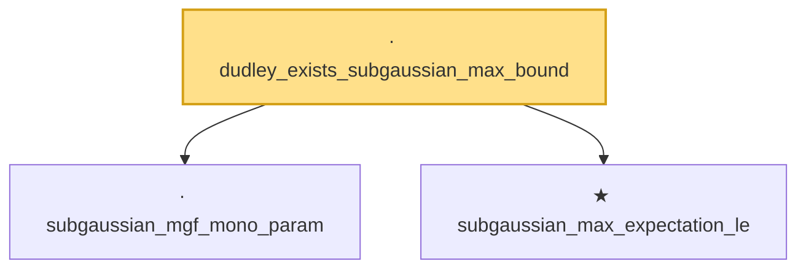

# Proof narrative — dudley_exists_subgaussian_max_bound

Root: **dudley_exists_subgaussian_max_bound** (lemma) `Statlib/StatFoundation/EmpiricalProcess/DudleyEntropyIntegral.lean:109` · topic `StatFoundation`
Closure: 3 declarations across 3 files. Generated from `proof_graph.json` — no files were moved.

Reading order (foundations first, headline last):

  · `subgaussian_mgf_mono_param` — lemma · `Statlib/StatFoundation/RandomVariable/SubGaussian/subgaussian_mgf_mono_param.lean:10`  _(also used by 5: decoupledOffDiagQuadForm_const_right_abs_tail_real_spectral, decoupledOffDiagQuadForm_const_right_abs_tail_real_frobenius, decoupledOffDiagQuadForm_const_right_abs_tail_real_of_coeff_norm_sq_le, …)_
  ★ `subgaussian_max_expectation_le` — theorem · `Statlib/StatFoundation/Concentration/ExponentialType/subgaussian_max_expectation_le.lean:13`  _(also used by 3: dudley_exists_chaining_increment_bound, dudley_entropy_integral, finite_class_rademacher_complexity)_
· `dudley_exists_subgaussian_max_bound` — lemma · `Statlib/StatFoundation/EmpiricalProcess/DudleyEntropyIntegral.lean:109` **← headline**

## Dependency diagram

