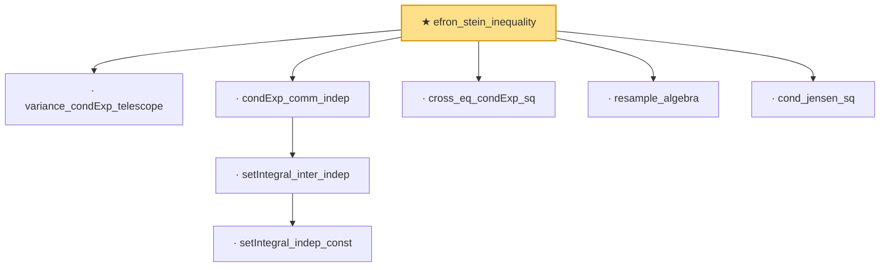

# Proof narrative — efron_stein_inequality

Root: **efron_stein_inequality** (theorem) `Statlib/StatFoundation/Concentration/MomentType/efron_stein_inequality.lean:254` · topic `StatFoundation`
Closure: 8 declarations across 1 files. Generated from `proof_graph.json` — no files were moved.

Reading order (foundations first, headline last):

  · `variance_condExp_telescope` — lemma · `Statlib/StatFoundation/Concentration/MomentType/efron_stein_inequality.lean:232`
      · `setIntegral_indep_const` — private lemma · `Statlib/StatFoundation/Concentration/MomentType/efron_stein_inequality.lean:39`
    · `setIntegral_inter_indep` — private lemma · `Statlib/StatFoundation/Concentration/MomentType/efron_stein_inequality.lean:54`
  · `condExp_comm_indep` — private lemma · `Statlib/StatFoundation/Concentration/MomentType/efron_stein_inequality.lean:70`
  · `cross_eq_condExp_sq` — private lemma · `Statlib/StatFoundation/Concentration/MomentType/efron_stein_inequality.lean:194`
  · `resample_algebra` — private lemma · `Statlib/StatFoundation/Concentration/MomentType/efron_stein_inequality.lean:155`
  · `cond_jensen_sq` — private lemma · `Statlib/StatFoundation/Concentration/MomentType/efron_stein_inequality.lean:12`
★ `efron_stein_inequality` — theorem · `Statlib/StatFoundation/Concentration/MomentType/efron_stein_inequality.lean:254` **← headline**

## Dependency diagram

