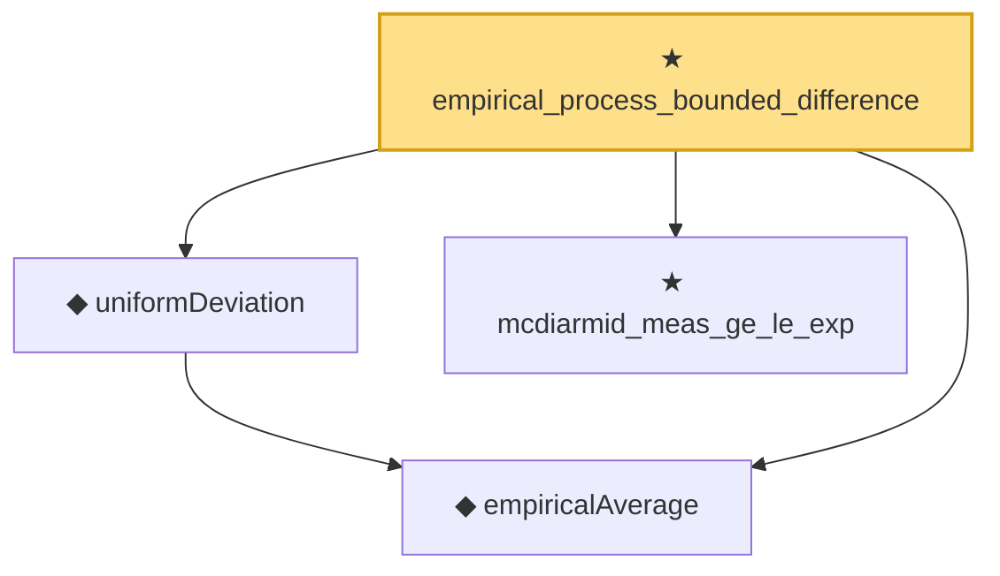

# Proof narrative — empirical_process_bounded_difference

Root: **empirical_process_bounded_difference** (theorem) `Statlib/StatFoundation/EmpiricalProcess/BoundedDifference.lean:8` · topic `StatFoundation`
Closure: 4 declarations across 3 files. Generated from `proof_graph.json` — no files were moved.

Reading order (foundations first, headline last):

  ◆ `empiricalAverage` — noncomputable def · `Statlib/StatFoundation/Vocabulary/EmpiricalProcess.lean:35`  _(also used by 3: rademacher_generalization_bound, empirical_symmetrization, uniform_deviation_finite_class)_
  ◆ `uniformDeviation` — noncomputable def · `Statlib/StatFoundation/Vocabulary/EmpiricalProcess.lean:43`  _(also used by 3: rademacher_generalization_bound, empirical_symmetrization, uniform_deviation_finite_class)_
  ★ `mcdiarmid_meas_ge_le_exp` — theorem · `Statlib/StatFoundation/Concentration/ExponentialType/mcdiarmid_meas_ge_le_exp.lean:9`  _(also used by 1: rademacher_generalization_bound)_
★ `empirical_process_bounded_difference` — theorem · `Statlib/StatFoundation/EmpiricalProcess/BoundedDifference.lean:8` **← headline**

## Dependency diagram

