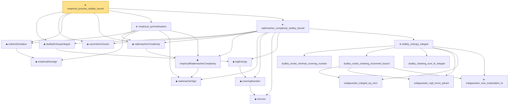

# Proof narrative — empirical_process_dudley_bound

Root: **empirical_process_dudley_bound** (theorem) `Statlib/StatFoundation/EmpiricalProcess/DudleyRademacher.lean:1085` · topic `StatFoundation`
Closure: 20 declarations across 8 files. Generated from `proof_graph.json` — no files were moved.

Reading order (foundations first, headline last):

    ◆ `IsCover` — def · `Statlib/StatFoundation/Vocabulary/CoveringNumbers.lean:75`  _(also used by 11: rkhsBall_exists_sup_cover_le_of_domainCover, rkhsBall_coveringNumber_le_of_domainCover, rkhsBall_coveringNumber_le_of_L2_internal, …)_
    ◆ `coveringNumber` — noncomputable def · `Statlib/StatFoundation/Vocabulary/CoveringNumbers.lean:81`  _(also used by 9: rkhsBall_coveringNumber_le_of_domainCover, rkhsBall_coveringNumber_le_of_L2_internal, rkhsBall_logEntropy_L2_le, …)_
    ◆ `logEntropy` — noncomputable def · `Statlib/StatFoundation/Vocabulary/CoveringNumbers.lean:85`  _(also used by 6: rkhsBall_logEntropy_L2_le, rkhsBall_logEntropyIntegral_truncated_le, rkhsBall_logEntropy_L2_le_of_range, …)_
  ◆ `dudleyEntropyIntegral` — noncomputable def · `Statlib/StatFoundation/Vocabulary/CoveringNumbers.lean:101`  _(also used by 5: rkhsBall_dudleyEntropyIntegral_le, dudleyEntropyIntegral_embedded_subset_le_two, rkhsBall_rademacher_complexity_dudley_le, …)_
  ◆ `symmetricClosure` — noncomputable def · `Statlib/StatFoundation/Vocabulary/EmpiricalProcess.lean:101`  _(also used by 3: dudleyEntropyIntegral_embedded_subset_le_two, rkhsBall_rademacher_complexity_dudley_le, empirical_rademacher_complexity_dudley_bound_of_abs_le)_
    ◆ `empiricalAverage` — noncomputable def · `Statlib/StatFoundation/Vocabulary/EmpiricalProcess.lean:35`  _(also used by 5: empirical_process_bounded_difference, rademacher_generalization_bound, finite_class_one_sided_deviation_tail_from_rademacher_complexity, …)_
  ◆ `uniformDeviation` — noncomputable def · `Statlib/StatFoundation/Vocabulary/EmpiricalProcess.lean:43`  _(also used by 3: empirical_process_bounded_difference, rademacher_generalization_bound, uniform_deviation_finite_class)_
    ◆ `rademacherSign` — def · `Statlib/StatFoundation/Vocabulary/EmpiricalProcess.lean:50`  _(also used by 15: l1_linear_rademacher_complexity_bound, finite_l1_quadratic_rademacher_coord_bound, finite_l1_quadratic_rademacher_coord_energy_bound, …)_
    ◆ `empiricalRademacherComplexity` — noncomputable def · `Statlib/StatFoundation/Vocabulary/EmpiricalProcess.lean:56`  _(also used by 4: finite_l1_quadratic_rademacher_coord_energy_bound, rkhsBall_rademacher_complexity_dudley_le, empirical_rademacher_complexity_dudley_bound_of_abs_le, …)_
  ◆ `rademacherComplexity` — noncomputable def · `Statlib/StatFoundation/Vocabulary/EmpiricalProcess.lean:67`  _(also used by 3: rkhsBall_rademacher_complexity_dudley_le, rademacher_generalization_bound, finite_class_one_sided_deviation_tail_from_rademacher_complexity)_
  ★ `empirical_symmetrization` — theorem · `Statlib/StatFoundation/EmpiricalProcess/Symmetrization.lean:25`  _(also used by 1: rademacher_generalization_bound)_
      · `dudley_exists_minimal_covering_number` — lemma · `Statlib/StatFoundation/EmpiricalProcess/DudleyEntropyIntegral.lean:13`  _(also used by 1: empirical_rademacher_complexity_dudley_bound_of_abs_le)_
      · `subgaussian_integral_eq_zero` — lemma · `Statlib/StatFoundation/RandomVariable/SubGaussian/subgaussian_integral_eq_zero.lean:12`  _(also used by 3: cov_trace_concentration, subgaussianVector_hasMean_zero, subgaussian_prod_subexponential)_
      · `subgaussian_mgf_mono_param` — lemma · `Statlib/StatFoundation/RandomVariable/SubGaussian/subgaussian_mgf_mono_param.lean:10`  _(also used by 4: decoupledOffDiagQuadForm_const_right_abs_tail_real_spectral, decoupledOffDiagQuadForm_const_right_abs_tail_real_frobenius, decoupledOffDiagQuadForm_const_right_abs_tail_real_of_coeff_norm_sq_le, …)_
      ★ `subgaussian_max_expectation_le` — theorem · `Statlib/StatFoundation/Concentration/ExponentialType/subgaussian_max_expectation_le.lean:13`  _(also used by 2: dudley_exists_subgaussian_max_bound, finite_class_rademacher_complexity)_
      · `dudley_exists_chaining_increment_bound` — lemma · `Statlib/StatFoundation/EmpiricalProcess/DudleyEntropyIntegral.lean:215`  _(also used by 1: empirical_rademacher_complexity_dudley_bound_of_abs_le)_
      · `dudley_chaining_sum_le_integral` — lemma · `Statlib/StatFoundation/EmpiricalProcess/DudleyEntropyIntegral.lean:552`
    ★ `dudley_entropy_integral` — theorem · `Statlib/StatFoundation/EmpiricalProcess/DudleyEntropyIntegral.lean:986`
  ★ `rademacher_complexity_dudley_bound` — theorem · `Statlib/StatFoundation/EmpiricalProcess/DudleyRademacher.lean:27`
★ `empirical_process_dudley_bound` — theorem · `Statlib/StatFoundation/EmpiricalProcess/DudleyRademacher.lean:1085` **← headline**

## Dependency diagram

