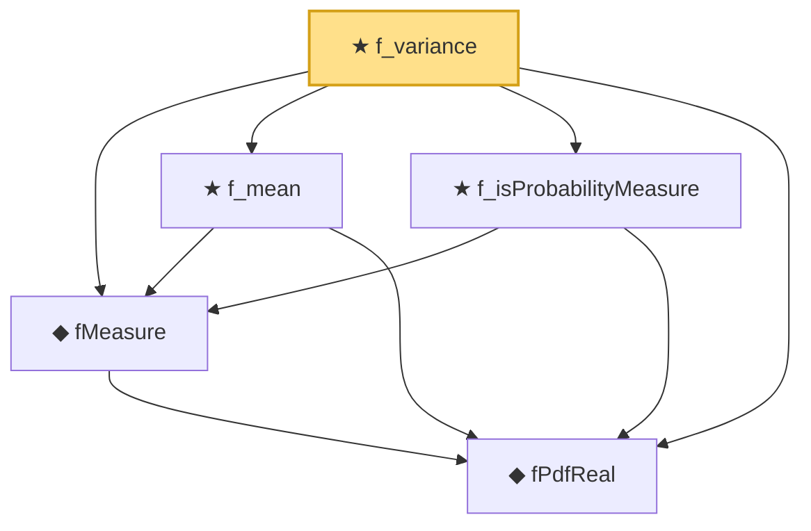

# Proof narrative — f_variance

Root: **f_variance** (theorem) `Statlib/StatFoundation/Probability/FDistribution.lean:1998` · topic `StatFoundation`
Closure: 5 declarations across 1 files. Generated from `proof_graph.json` — no files were moved.

Reading order (foundations first, headline last):

  ◆ `fPdfReal` — noncomputable def · `Statlib/StatFoundation/Probability/FDistribution.lean:24`  _(also used by 1: f_measure_eq_ratio)_
  ◆ `fMeasure` — noncomputable def · `Statlib/StatFoundation/Probability/FDistribution.lean:32`  _(also used by 4: two_sample_variance_ratio_test, variance_ratio_confidence_interval, variance_ratio_test_size, …)_
  ★ `f_mean` — theorem · `Statlib/StatFoundation/Probability/FDistribution.lean:1288`
  ★ `f_isProbabilityMeasure` — theorem · `Statlib/StatFoundation/Probability/FDistribution.lean:39`  _(also used by 1: variance_ratio_test_size)_
★ `f_variance` — theorem · `Statlib/StatFoundation/Probability/FDistribution.lean:1998` **← headline**

## Dependency diagram

