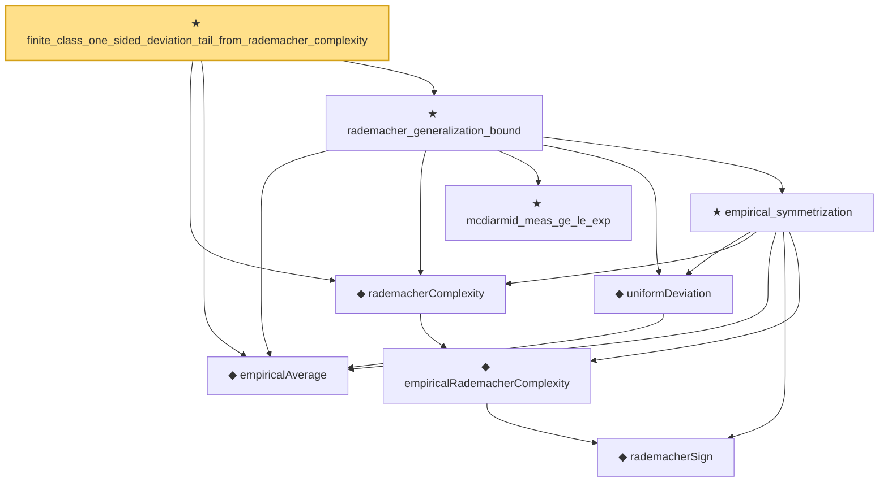

# Proof narrative — finite_class_one_sided_deviation_tail_from_rademacher_complexity

Root: **finite_class_one_sided_deviation_tail_from_rademacher_complexity** (theorem) `Statlib/StatFoundation/EmpiricalProcess/RademacherGeneralizationBound.lean:584` · topic `StatFoundation`
Closure: 9 declarations across 4 files. Generated from `proof_graph.json` — no files were moved.

Reading order (foundations first, headline last):

      ◆ `rademacherSign` — def · `Statlib/StatFoundation/Vocabulary/EmpiricalProcess.lean:50`  _(also used by 16: l1_linear_rademacher_complexity_bound, finite_l1_quadratic_rademacher_coord_bound, finite_l1_quadratic_rademacher_coord_energy_bound, …)_
    ◆ `empiricalRademacherComplexity` — noncomputable def · `Statlib/StatFoundation/Vocabulary/EmpiricalProcess.lean:56`  _(also used by 5: finite_l1_quadratic_rademacher_coord_energy_bound, rkhsBall_rademacher_complexity_dudley_le, rademacher_complexity_dudley_bound, …)_
  ◆ `rademacherComplexity` — noncomputable def · `Statlib/StatFoundation/Vocabulary/EmpiricalProcess.lean:67`  _(also used by 3: rkhsBall_rademacher_complexity_dudley_le, rademacher_complexity_dudley_bound, empirical_process_dudley_bound)_
  ◆ `empiricalAverage` — noncomputable def · `Statlib/StatFoundation/Vocabulary/EmpiricalProcess.lean:35`  _(also used by 3: empirical_process_bounded_difference, uniform_deviation_finite_class, signedEmpiricalProcessSup)_
    ★ `mcdiarmid_meas_ge_le_exp` — theorem · `Statlib/StatFoundation/Concentration/ExponentialType/mcdiarmid_meas_ge_le_exp.lean:9`  _(also used by 1: empirical_process_bounded_difference)_
    ◆ `uniformDeviation` — noncomputable def · `Statlib/StatFoundation/Vocabulary/EmpiricalProcess.lean:43`  _(also used by 3: empirical_process_bounded_difference, empirical_process_dudley_bound, uniform_deviation_finite_class)_
    ★ `empirical_symmetrization` — theorem · `Statlib/StatFoundation/EmpiricalProcess/Symmetrization.lean:25`  _(also used by 1: empirical_process_dudley_bound)_
  ★ `rademacher_generalization_bound` — theorem · `Statlib/StatFoundation/EmpiricalProcess/RademacherGeneralizationBound.lean:15`
★ `finite_class_one_sided_deviation_tail_from_rademacher_complexity` — theorem · `Statlib/StatFoundation/EmpiricalProcess/RademacherGeneralizationBound.lean:584` **← headline**

## Dependency diagram

