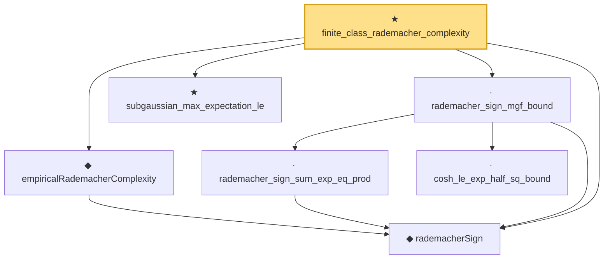

# Proof narrative — finite_class_rademacher_complexity

Root: **finite_class_rademacher_complexity** (theorem) `Statlib/StatFoundation/EmpiricalProcess/FiniteClassRademacherComplexity.lean:13` · topic `StatFoundation`
Closure: 7 declarations across 4 files. Generated from `proof_graph.json` — no files were moved.

Reading order (foundations first, headline last):

  ◆ `rademacherSign` — def · `Statlib/StatFoundation/Vocabulary/EmpiricalProcess.lean:50`  _(also used by 3: rademacher_contraction_with_offset, rademacher_contraction, empirical_symmetrization)_
  ◆ `empiricalRademacherComplexity` — noncomputable def · `Statlib/StatFoundation/Vocabulary/EmpiricalProcess.lean:56`  _(also used by 2: empirical_symmetrization, rademacherComplexity)_
    · `rademacher_sign_sum_exp_eq_prod` — private lemma · `Statlib/StatFoundation/EmpiricalProcess/RademacherSignMGF.lean:11`
    · `cosh_le_exp_half_sq_bound` — private lemma · `Statlib/StatFoundation/EmpiricalProcess/RademacherSignMGF.lean:37`
  · `rademacher_sign_mgf_bound` — lemma · `Statlib/StatFoundation/EmpiricalProcess/RademacherSignMGF.lean:41`
  ★ `subgaussian_max_expectation_le` — theorem · `Statlib/StatFoundation/Concentration/ExponentialType/subgaussian_max_expectation_le.lean:13`  _(also used by 3: dudley_exists_subgaussian_max_bound, dudley_exists_chaining_increment_bound, dudley_entropy_integral)_
★ `finite_class_rademacher_complexity` — theorem · `Statlib/StatFoundation/EmpiricalProcess/FiniteClassRademacherComplexity.lean:13` **← headline**

## Dependency diagram

