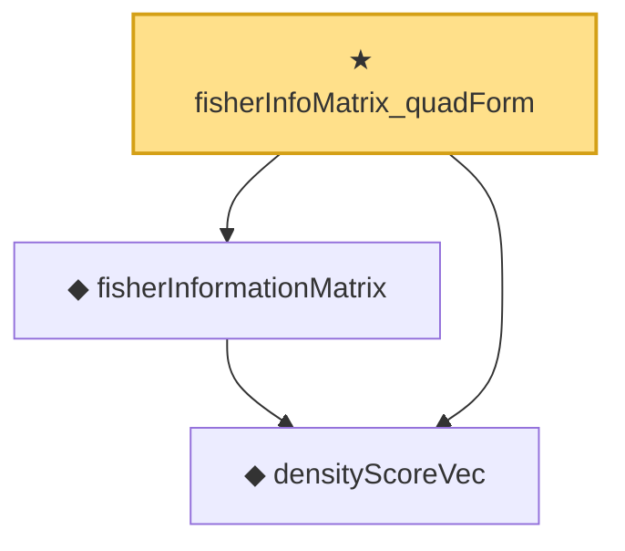

# Proof narrative — fisherInfoMatrix_quadForm

Root: **fisherInfoMatrix_quadForm** (theorem) `Statlib/StatFoundation/Statistics/Estimation/MultiParameter.lean:181` · topic `StatFoundation`
Closure: 3 declarations across 2 files. Generated from `proof_graph.json` — no files were moved.

Reading order (foundations first, headline last):

  ◆ `densityScoreVec` — noncomputable def · `Statlib/StatFoundation/Statistics/Estimation/Vocabulary.lean:161`  _(also used by 6: fisherInformationMatrix_posSemidef, score_mean_zero_vec, unbiased_derivative_eq_cov_score_vec, …)_
  ◆ `fisherInformationMatrix` — noncomputable def · `Statlib/StatFoundation/Statistics/Estimation/Vocabulary.lean:173`  _(also used by 5: fisherInformationMatrix_symm, fisherInformationMatrix_posSemidef, matrix_cram, …)_
★ `fisherInfoMatrix_quadForm` — theorem · `Statlib/StatFoundation/Statistics/Estimation/MultiParameter.lean:181` **← headline**

## Dependency diagram

