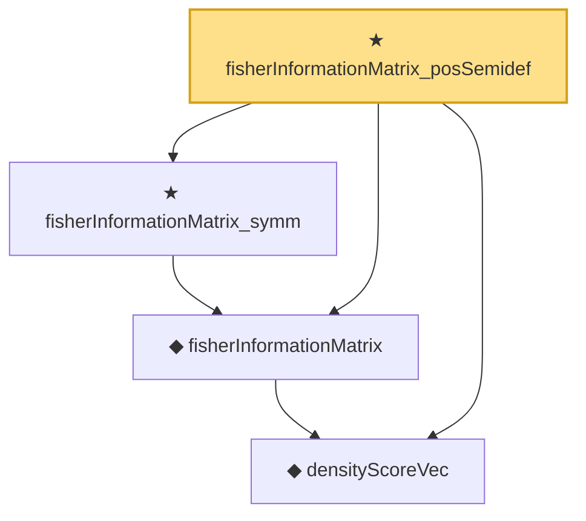

# Proof narrative — fisherInformationMatrix_posSemidef

Root: **fisherInformationMatrix_posSemidef** (theorem) `Statlib/StatFoundation/Statistics/Estimation/MultiParameter.lean:87` · topic `StatFoundation`
Closure: 4 declarations across 2 files. Generated from `proof_graph.json` — no files were moved.

Reading order (foundations first, headline last):

  ◆ `densityScoreVec` — noncomputable def · `Statlib/StatFoundation/Statistics/Estimation/Vocabulary.lean:161`  _(also used by 6: fisherInfoMatrix_quadForm, score_mean_zero_vec, unbiased_derivative_eq_cov_score_vec, …)_
  ◆ `fisherInformationMatrix` — noncomputable def · `Statlib/StatFoundation/Statistics/Estimation/Vocabulary.lean:173`  _(also used by 4: fisherInfoMatrix_quadForm, matrix_cram, mle_asymptotic_normal_vec_cov, …)_
  ★ `fisherInformationMatrix_symm` — theorem · `Statlib/StatFoundation/Statistics/Estimation/MultiParameter.lean:72`  _(also used by 2: matrix_cram, mle_asymptotic_normal_vec_cov)_
★ `fisherInformationMatrix_posSemidef` — theorem · `Statlib/StatFoundation/Statistics/Estimation/MultiParameter.lean:87` **← headline**

## Dependency diagram

