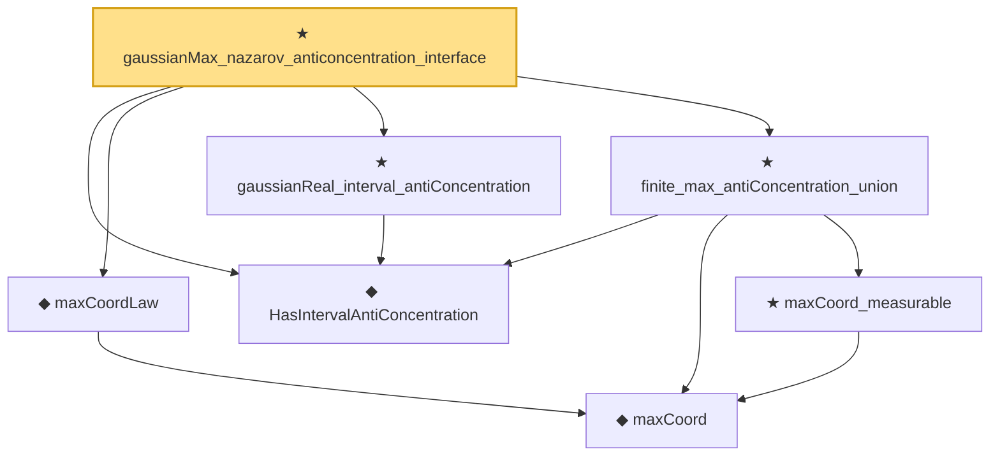

# Proof narrative — gaussianMax_nazarov_anticoncentration_interface

Root: **gaussianMax_nazarov_anticoncentration_interface** (theorem) `Statlib/StatFoundation/Convergence/Resampling/GaussianMaxComparison.lean:33` · topic `StatFoundation`
Closure: 7 declarations across 5 files. Generated from `proof_graph.json` — no files were moved.

Reading order (foundations first, headline last):

  ◆ `HasIntervalAntiConcentration` — def · `Statlib/StatFoundation/Vocabulary/Resampling.lean:36`  _(also used by 3: kolmogorov_distance_transfer_to_quantile_coverage, bootstrap_coverage_from_distance_and_anticonc, maxLaw_CDF_bound_of_coordinatewise_proximity)_
    ◆ `maxCoord` — noncomputable def · `Statlib/StatFoundation/Vocabulary/MaxType.lean:34`  _(also used by 10: smoothMax_bounds_max_log_card, maxCoord_lipschitz, maxCoord_lipschitz_ineq, …)_
  ◆ `maxCoordLaw` — noncomputable abbrev · `Statlib/StatFoundation/Vocabulary/MaxType.lean:45`  _(also used by 1: bootstrap_coverage_from_distance_and_anticonc)_
  ★ `gaussianReal_interval_antiConcentration` — theorem · `Statlib/StatFoundation/Convergence/Resampling/AntiConcentration.lean:22`  _(also used by 1: bootstrap_coverage_from_distance_and_anticonc)_
    ★ `maxCoord_measurable` — theorem · `Statlib/StatFoundation/Convergence/CentralLimitTheorem/MaxType.lean:29`  _(also used by 3: bootstrapMaxLaw_isProbabilityMeasure, bootstrap_coverage_from_distance_and_anticonc, maxLaw_CDF_bound_of_coordinatewise_proximity)_
  ★ `finite_max_antiConcentration_union` — theorem · `Statlib/StatFoundation/Convergence/Resampling/AntiConcentration.lean:67`  _(also used by 1: bootstrap_coverage_from_distance_and_anticonc)_
★ `gaussianMax_nazarov_anticoncentration_interface` — theorem · `Statlib/StatFoundation/Convergence/Resampling/GaussianMaxComparison.lean:33` **← headline**

## Dependency diagram

