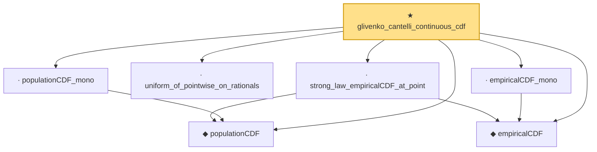

# Proof narrative — glivenko_cantelli_continuous_cdf

Root: **glivenko_cantelli_continuous_cdf** (theorem) `Statlib/StatFoundation/Convergence/LawOfLargeNumbers/GlivenkoCantelli.lean:314` · topic `StatFoundation`
Closure: 7 declarations across 1 files. Generated from `proof_graph.json` — no files were moved.

Reading order (foundations first, headline last):

  ◆ `populationCDF` — noncomputable def · `Statlib/StatFoundation/Convergence/LawOfLargeNumbers/GlivenkoCantelli.lean:42`  _(also used by 2: glivenko_cantelli_one_sided_positive, glivenko_cantelli_quantitative)_
  ◆ `empiricalCDF` — noncomputable def · `Statlib/StatFoundation/Convergence/LawOfLargeNumbers/GlivenkoCantelli.lean:17`  _(also used by 2: glivenko_cantelli_one_sided_positive, glivenko_cantelli_quantitative)_
  · `strong_law_empiricalCDF_at_point` — lemma · `Statlib/StatFoundation/Convergence/LawOfLargeNumbers/GlivenkoCantelli.lean:69`
  · `uniform_of_pointwise_on_rationals` — lemma · `Statlib/StatFoundation/Convergence/LawOfLargeNumbers/GlivenkoCantelli.lean:131`
  · `empiricalCDF_mono` — lemma · `Statlib/StatFoundation/Convergence/LawOfLargeNumbers/GlivenkoCantelli.lean:28`
  · `populationCDF_mono` — lemma · `Statlib/StatFoundation/Convergence/LawOfLargeNumbers/GlivenkoCantelli.lean:52`  _(also used by 1: glivenko_cantelli_one_sided_positive)_
★ `glivenko_cantelli_continuous_cdf` — theorem · `Statlib/StatFoundation/Convergence/LawOfLargeNumbers/GlivenkoCantelli.lean:314` **← headline**

## Dependency diagram

