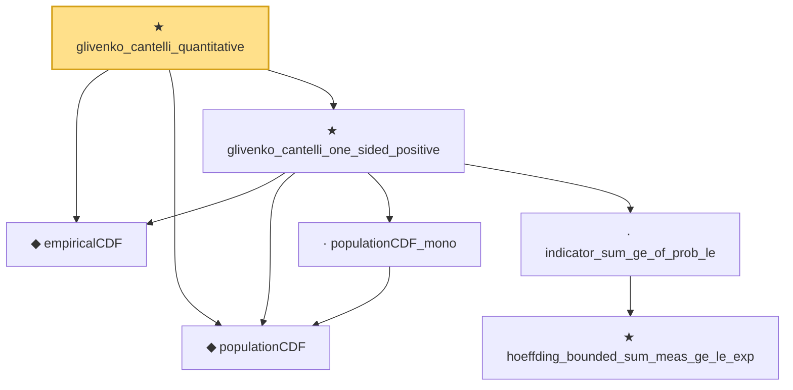

# Proof narrative — glivenko_cantelli_quantitative

Root: **glivenko_cantelli_quantitative** (theorem) `Statlib/StatFoundation/EmpiricalProcess/GlivenkoCantelliQuantitative.lean:937` · topic `StatFoundation`
Closure: 7 declarations across 3 files. Generated from `proof_graph.json` — no files were moved.

Reading order (foundations first, headline last):

  ◆ `empiricalCDF` — noncomputable def · `Statlib/StatFoundation/Convergence/LawOfLargeNumbers/GlivenkoCantelli.lean:17`  _(also used by 3: empiricalCDF_mono, strong_law_empiricalCDF_at_point, glivenko_cantelli_continuous_cdf)_
  ◆ `populationCDF` — noncomputable def · `Statlib/StatFoundation/Convergence/LawOfLargeNumbers/GlivenkoCantelli.lean:42`  _(also used by 2: strong_law_empiricalCDF_at_point, glivenko_cantelli_continuous_cdf)_
    · `populationCDF_mono` — lemma · `Statlib/StatFoundation/Convergence/LawOfLargeNumbers/GlivenkoCantelli.lean:52`  _(also used by 1: glivenko_cantelli_continuous_cdf)_
      ★ `hoeffding_bounded_sum_meas_ge_le_exp` — theorem · `Statlib/StatFoundation/Concentration/ExponentialType/hoeffding_bounded_sum_meas_ge_le_exp.lean:10`
    · `indicator_sum_ge_of_prob_le` — private lemma · `Statlib/StatFoundation/EmpiricalProcess/GlivenkoCantelliQuantitative.lean:10`
  ★ `glivenko_cantelli_one_sided_positive` — theorem · `Statlib/StatFoundation/EmpiricalProcess/GlivenkoCantelliQuantitative.lean:116`
★ `glivenko_cantelli_quantitative` — theorem · `Statlib/StatFoundation/EmpiricalProcess/GlivenkoCantelliQuantitative.lean:937` **← headline**

## Dependency diagram

