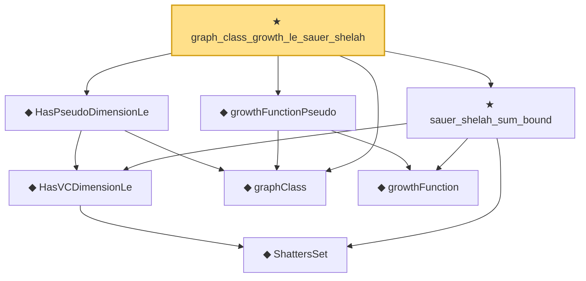

# Proof narrative — graph_class_growth_le_sauer_shelah

Root: **graph_class_growth_le_sauer_shelah** (theorem) `Statlib/StatFoundation/Vocabulary/VCDimension.lean:454` · topic `StatFoundation`
Closure: 8 declarations across 1 files. Generated from `proof_graph.json` — no files were moved.

Reading order (foundations first, headline last):

    ◆ `ShattersSet` — def · `Statlib/StatFoundation/Vocabulary/VCDimension.lean:43`  _(also used by 2: vcDimension, HasVCDimensionRealLe)_
    ◆ `HasVCDimensionLe` — def · `Statlib/StatFoundation/Vocabulary/VCDimension.lean:60`  _(also used by 2: IsVCClass, growth_function_real_le_sauer_shelah)_
  ◆ `graphClass` — def · `Statlib/StatFoundation/Vocabulary/VCDimension.lean:124`
  ◆ `HasPseudoDimensionLe` — def · `Statlib/StatFoundation/Vocabulary/VCDimension.lean:134`
    ◆ `growthFunction` — noncomputable def · `Statlib/StatFoundation/Vocabulary/VCDimension.lean:72`  _(also used by 2: growthFunctionReal, growthFunction_le_two_pow)_
  ◆ `growthFunctionPseudo` — noncomputable def · `Statlib/StatFoundation/Vocabulary/VCDimension.lean:139`
  ★ `sauer_shelah_sum_bound` — theorem · `Statlib/StatFoundation/Vocabulary/VCDimension.lean:206`  _(also used by 1: growth_function_real_le_sauer_shelah)_
★ `graph_class_growth_le_sauer_shelah` — theorem · `Statlib/StatFoundation/Vocabulary/VCDimension.lean:454` **← headline**

## Dependency diagram

