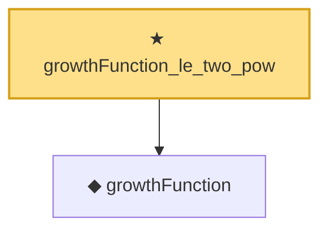

# Proof narrative — growthFunction_le_two_pow

Root: **growthFunction_le_two_pow** (theorem) `Statlib/StatFoundation/Vocabulary/VCDimension.lean:163` · topic `StatFoundation`
Closure: 2 declarations across 1 files. Generated from `proof_graph.json` — no files were moved.

Reading order (foundations first, headline last):

  ◆ `growthFunction` — noncomputable def · `Statlib/StatFoundation/Vocabulary/VCDimension.lean:72`  _(also used by 3: growthFunctionReal, growthFunctionPseudo, sauer_shelah_sum_bound)_
★ `growthFunction_le_two_pow` — theorem · `Statlib/StatFoundation/Vocabulary/VCDimension.lean:163` **← headline**

## Dependency diagram

