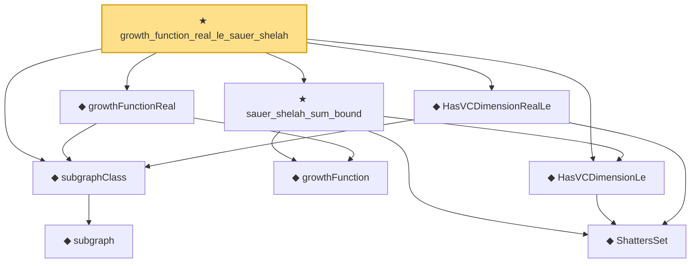

# Proof narrative — growth_function_real_le_sauer_shelah

Root: **growth_function_real_le_sauer_shelah** (theorem) `Statlib/StatFoundation/Vocabulary/VCDimension.lean:442` · topic `StatFoundation`
Closure: 9 declarations across 1 files. Generated from `proof_graph.json` — no files were moved.

Reading order (foundations first, headline last):

    ◆ `ShattersSet` — def · `Statlib/StatFoundation/Vocabulary/VCDimension.lean:43`  _(also used by 1: vcDimension)_
      ◆ `subgraph` — def · `Statlib/StatFoundation/Vocabulary/VCDimension.lean:83`
  ◆ `subgraphClass` — def · `Statlib/StatFoundation/Vocabulary/VCDimension.lean:87`  _(also used by 1: vcDimensionReal)_
  ◆ `HasVCDimensionRealLe` — def · `Statlib/StatFoundation/Vocabulary/VCDimension.lean:109`  _(also used by 1: IsVCRealClass)_
    ◆ `growthFunction` — noncomputable def · `Statlib/StatFoundation/Vocabulary/VCDimension.lean:72`  _(also used by 2: growthFunctionPseudo, growthFunction_le_two_pow)_
  ◆ `growthFunctionReal` — noncomputable def · `Statlib/StatFoundation/Vocabulary/VCDimension.lean:113`
  ◆ `HasVCDimensionLe` — def · `Statlib/StatFoundation/Vocabulary/VCDimension.lean:60`  _(also used by 2: HasPseudoDimensionLe, IsVCClass)_
  ★ `sauer_shelah_sum_bound` — theorem · `Statlib/StatFoundation/Vocabulary/VCDimension.lean:206`  _(also used by 1: graph_class_growth_le_sauer_shelah)_
★ `growth_function_real_le_sauer_shelah` — theorem · `Statlib/StatFoundation/Vocabulary/VCDimension.lean:442` **← headline**

## Dependency diagram

