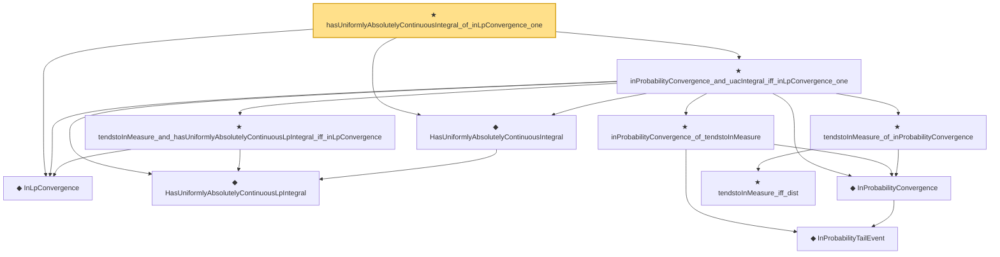

# Proof narrative — hasUniformlyAbsolutelyContinuousIntegral_of_inLpConvergence_one

Root: **hasUniformlyAbsolutelyContinuousIntegral_of_inLpConvergence_one** (theorem) `Statlib/StatFoundation/Convergence/AnalysisTools/UniformIntegrability.lean:192` · topic `StatFoundation`
Closure: 11 declarations across 3 files. Generated from `proof_graph.json` — no files were moved.

Reading order (foundations first, headline last):

  ◆ `InLpConvergence` — def · `Statlib/StatFoundation/Convergence/AnalysisTools/ConvergenceModes.lean:77`  _(also used by 66: inLpConvergence_congr_left, inLpConvergence_congr_right, inLpConvergence_congr, …)_
    ◆ `HasUniformlyAbsolutelyContinuousLpIntegral` — abbrev · `Statlib/StatFoundation/Vocabulary/UniformIntegrability.lean:25`  _(also used by 4: tendsto_eLpNorm_zero_of_tendstoInMeasure_of_hasUniformlyAbsolutelyContinuousLpIntegral, inLpConvergence_of_tendstoInMeasure_of_hasUniformlyAbsolutelyContinuousLpIntegral, hasUniformlyAbsolutelyContinuousLpIntegral_of_inLpConvergence, …)_
  ◆ `HasUniformlyAbsolutelyContinuousIntegral` — abbrev · `Statlib/StatFoundation/Vocabulary/UniformIntegrability.lean:30`
      ◆ `InProbabilityTailEvent` — def · `Statlib/StatFoundation/Convergence/AnalysisTools/ConvergenceModes.lean:46`  _(also used by 9: t_test_consistent, CompleteConvergence, as_implies_inProbability, …)_
    ◆ `InProbabilityConvergence` — def · `Statlib/StatFoundation/Convergence/AnalysisTools/ConvergenceModes.lean:61`  _(also used by 72: t_test_consistent, inProbabilityConvergence_iff_tendstoInMeasure, inProbabilityConvergence_subseq, …)_
    ★ `tendstoInMeasure_and_hasUniformlyAbsolutelyContinuousLpIntegral_iff_inLpConvergence` — theorem · `Statlib/StatFoundation/Convergence/AnalysisTools/UniformIntegrability.lean:104`  _(also used by 1: hasUniformlyAbsolutelyContinuousLpIntegral_of_inLpConvergence)_
      ★ `tendstoInMeasure_iff_dist` — theorem · `Statlib/StatFoundation/Convergence/AnalysisTools/ConvergenceModes.lean:574`  _(also used by 5: tendstoInMeasure_lipschitz, tendstoInMeasure_inv_of_ne_zero, tendstoInMeasure_const_of_rescaled_tendstoInDistribution, …)_
    ★ `tendstoInMeasure_of_inProbabilityConvergence` — theorem · `Statlib/StatFoundation/Convergence/AnalysisTools/ConvergenceModes.lean:696`  _(also used by 10: inProbabilityConvergence_iff_tendstoInMeasure, inProbabilityConvergence_subseq, inProbabilityConvergence_congr_left, …)_
    ★ `inProbabilityConvergence_of_tendstoInMeasure` — theorem · `Statlib/StatFoundation/Convergence/AnalysisTools/ConvergenceModes.lean:712`  _(also used by 8: inProbabilityConvergence_iff_tendstoInMeasure, inProbabilityConvergence_subseq, inProbabilityConvergence_congr_left, …)_
  ★ `inProbabilityConvergence_and_uacIntegral_iff_inLpConvergence_one` — theorem · `Statlib/StatFoundation/Convergence/AnalysisTools/UniformIntegrability.lean:165`
★ `hasUniformlyAbsolutelyContinuousIntegral_of_inLpConvergence_one` — theorem · `Statlib/StatFoundation/Convergence/AnalysisTools/UniformIntegrability.lean:192` **← headline**

## Dependency diagram

