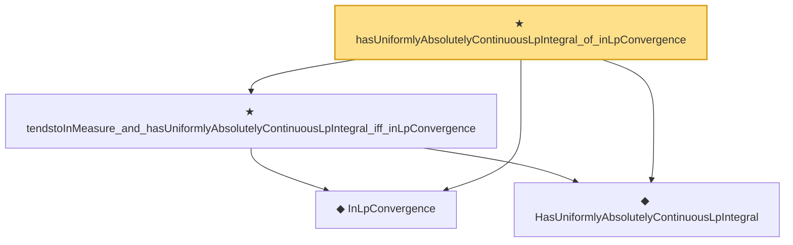

# Proof narrative — hasUniformlyAbsolutelyContinuousLpIntegral_of_inLpConvergence

Root: **hasUniformlyAbsolutelyContinuousLpIntegral_of_inLpConvergence** (theorem) `Statlib/StatFoundation/Convergence/AnalysisTools/UniformIntegrability.lean:118` · topic `StatFoundation`
Closure: 4 declarations across 3 files. Generated from `proof_graph.json` — no files were moved.

Reading order (foundations first, headline last):

  ◆ `InLpConvergence` — def · `Statlib/StatFoundation/Convergence/AnalysisTools/ConvergenceModes.lean:77`  _(also used by 67: inLpConvergence_congr_left, inLpConvergence_congr_right, inLpConvergence_congr, …)_
  ◆ `HasUniformlyAbsolutelyContinuousLpIntegral` — abbrev · `Statlib/StatFoundation/Vocabulary/UniformIntegrability.lean:25`  _(also used by 5: tendsto_eLpNorm_zero_of_tendstoInMeasure_of_hasUniformlyAbsolutelyContinuousLpIntegral, inLpConvergence_of_tendstoInMeasure_of_hasUniformlyAbsolutelyContinuousLpIntegral, inProbabilityConvergence_and_uacIntegral_iff_inLpConvergence_one, …)_
  ★ `tendstoInMeasure_and_hasUniformlyAbsolutelyContinuousLpIntegral_iff_inLpConvergence` — theorem · `Statlib/StatFoundation/Convergence/AnalysisTools/UniformIntegrability.lean:104`  _(also used by 1: inProbabilityConvergence_and_uacIntegral_iff_inLpConvergence_one)_
★ `hasUniformlyAbsolutelyContinuousLpIntegral_of_inLpConvergence` — theorem · `Statlib/StatFoundation/Convergence/AnalysisTools/UniformIntegrability.lean:118` **← headline**

## Dependency diagram

