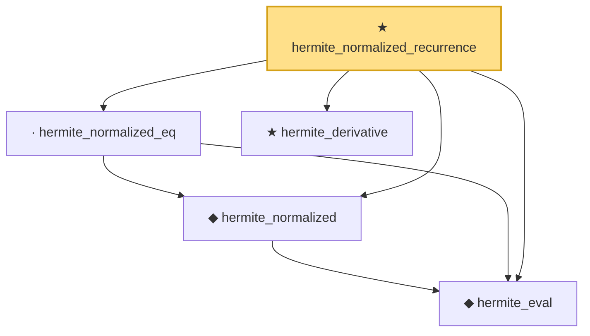

# Proof narrative — hermite_normalized_recurrence

Root: **hermite_normalized_recurrence** (theorem) `Statlib/StatFoundation/RandomVariable/Gaussian/Hermite.lean:250` · topic `StatFoundation`
Closure: 5 declarations across 1 files. Generated from `proof_graph.json` — no files were moved.

Reading order (foundations first, headline last):

  ◆ `hermite_eval` — abbrev · `Statlib/StatFoundation/RandomVariable/Gaussian/Hermite.lean:58`  _(also used by 13: hasDerivAt_hermite_eval, hasDerivAt_hermite_eval_mul, memLp_hermite_eval_mul, …)_
  ◆ `hermite_normalized` — noncomputable def · `Statlib/StatFoundation/RandomVariable/Gaussian/Hermite.lean:219`  _(also used by 2: integral_hermite_normalized_mul_eq, integral_deriv_mul_hermite_normalized)_
  · `hermite_normalized_eq` — lemma · `Statlib/StatFoundation/RandomVariable/Gaussian/Hermite.lean:222`
  ★ `hermite_derivative` — theorem · `Statlib/StatFoundation/RandomVariable/Gaussian/Hermite.lean:24`  _(also used by 1: integral_hermite_eval_mul_succ)_
★ `hermite_normalized_recurrence` — theorem · `Statlib/StatFoundation/RandomVariable/Gaussian/Hermite.lean:250` **← headline**

## Dependency diagram

