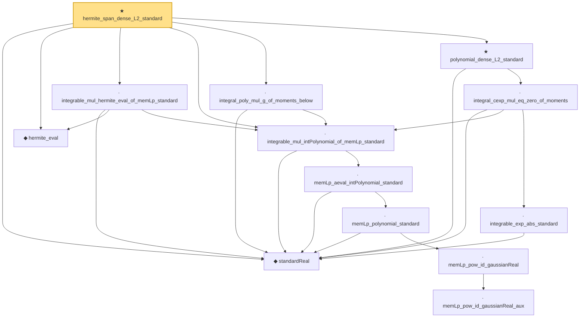

# Proof narrative — hermite_span_dense_L2_standard

Root: **hermite_span_dense_L2_standard** (theorem) `Statlib/StatFoundation/RandomVariable/Gaussian/Hermite.lean:682` · topic `StatFoundation`
Closure: 13 declarations across 2 files. Generated from `proof_graph.json` — no files were moved.

Reading order (foundations first, headline last):

  ◆ `standardReal` — abbrev · `Statlib/StatFoundation/RandomVariable/Gaussian/Standard.lean:31`  _(also used by 26: integrable_aeval_intPolynomial_standard, memLp_hermite_eval_mul, memLp_deriv_hermite_eval_mul, …)_
  ◆ `hermite_eval` — abbrev · `Statlib/StatFoundation/RandomVariable/Gaussian/Hermite.lean:58`  _(also used by 14: hasDerivAt_hermite_eval, hasDerivAt_hermite_eval_mul, memLp_hermite_eval_mul, …)_
            · `memLp_pow_id_gaussianReal_aux` — private lemma · `Statlib/StatFoundation/RandomVariable/Gaussian/Standard.lean:114`
          · `memLp_pow_id_gaussianReal` — lemma · `Statlib/StatFoundation/RandomVariable/Gaussian/Standard.lean:139`
        · `memLp_polynomial_standard` — lemma · `Statlib/StatFoundation/RandomVariable/Gaussian/Standard.lean:144`  _(also used by 2: integrable_mul_polynomial_of_memLp_standard, integrable_polynomial_mul_pdf_standard)_
      · `memLp_aeval_intPolynomial_standard` — lemma · `Statlib/StatFoundation/RandomVariable/Gaussian/Hermite.lean:43`  _(also used by 4: integrable_aeval_intPolynomial_standard, memLp_hermite_eval_mul, memLp_deriv_hermite_eval_mul, …)_
  · `integrable_mul_intPolynomial_of_memLp_standard` — lemma · `Statlib/StatFoundation/RandomVariable/Gaussian/Hermite.lean:291`
  · `integrable_mul_hermite_eval_of_memLp_standard` — lemma · `Statlib/StatFoundation/RandomVariable/Gaussian/Hermite.lean:310`  _(also used by 1: integral_deriv_mul_hermite_eval)_
  · `integral_poly_mul_g_of_moments_below` — private lemma · `Statlib/StatFoundation/RandomVariable/Gaussian/Hermite.lean:660`
      · `integrable_exp_abs_standard` — lemma · `Statlib/StatFoundation/RandomVariable/Gaussian/Standard.lean:239`  _(also used by 1: integrable_exp_norm_standardPi_of_nonneg)_
    · `integral_cexp_mul_eq_zero_of_moments` — lemma · `Statlib/StatFoundation/RandomVariable/Gaussian/Hermite.lean:460`
  ★ `polynomial_dense_L2_standard` — theorem · `Statlib/StatFoundation/RandomVariable/Gaussian/Hermite.lean:551`
★ `hermite_span_dense_L2_standard` — theorem · `Statlib/StatFoundation/RandomVariable/Gaussian/Hermite.lean:682` **← headline**

## Dependency diagram

