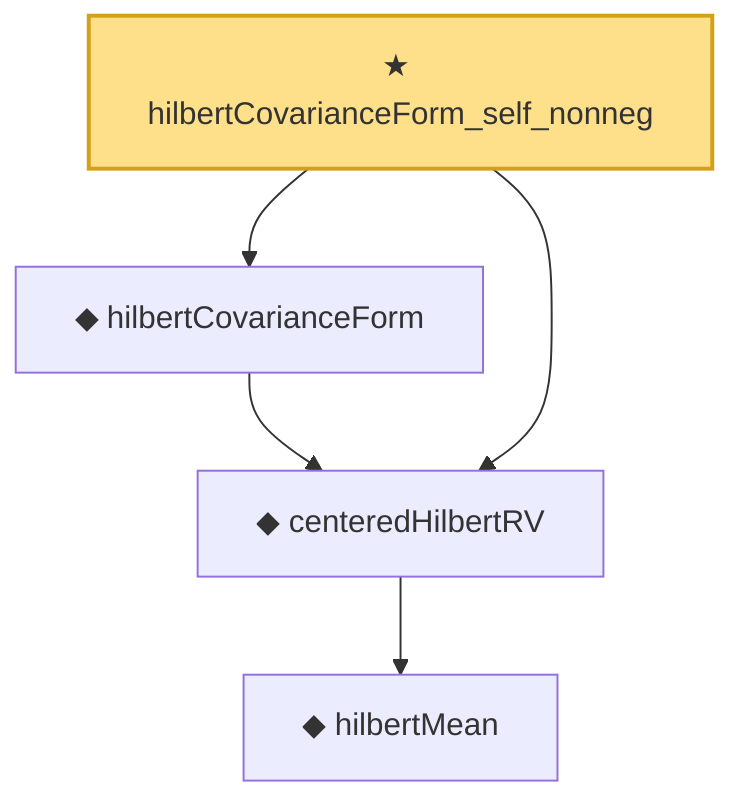

# Proof narrative — hilbertCovarianceForm_self_nonneg

Root: **hilbertCovarianceForm_self_nonneg** (theorem) `Statlib/StatFoundation/RandomVariable/HilbertValue/Covariance.lean:30` · topic `StatFoundation`
Closure: 4 declarations across 2 files. Generated from `proof_graph.json` — no files were moved.

Reading order (foundations first, headline last):

      ◆ `hilbertMean` — noncomputable def · `Statlib/StatFoundation/RandomVariable/HilbertValue/Vocabulary.lean:22`  _(also used by 5: meanEstimator_unbiased, meanEstimator_l2_error, meanEstimator_pointwise_holder, …)_
  ◆ `centeredHilbertRV` — noncomputable def · `Statlib/StatFoundation/RandomVariable/HilbertValue/Vocabulary.lean:26`  _(also used by 1: hilbertCovarianceForm_integrability_bridge)_
  ◆ `hilbertCovarianceForm` — noncomputable def · `Statlib/StatFoundation/RandomVariable/HilbertValue/Vocabulary.lean:32`  _(also used by 1: hilbertCovarianceForm_comm)_
★ `hilbertCovarianceForm_self_nonneg` — theorem · `Statlib/StatFoundation/RandomVariable/HilbertValue/Covariance.lean:30` **← headline**

## Dependency diagram

