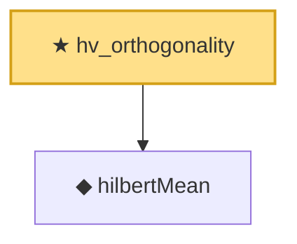

# Proof narrative — hv_orthogonality

Root: **hv_orthogonality** (theorem) `Statlib/StatFoundation/RandomVariable/HilbertValue/Covariance.lean:55` · topic `StatFoundation`
Closure: 2 declarations across 2 files. Generated from `proof_graph.json` — no files were moved.

Reading order (foundations first, headline last):

  ◆ `hilbertMean` — noncomputable def · `Statlib/StatFoundation/RandomVariable/HilbertValue/Vocabulary.lean:22`  _(also used by 5: meanEstimator_unbiased, meanEstimator_l2_error, meanEstimator_pointwise_holder, …)_
★ `hv_orthogonality` — theorem · `Statlib/StatFoundation/RandomVariable/HilbertValue/Covariance.lean:55` **← headline**

## Dependency diagram

