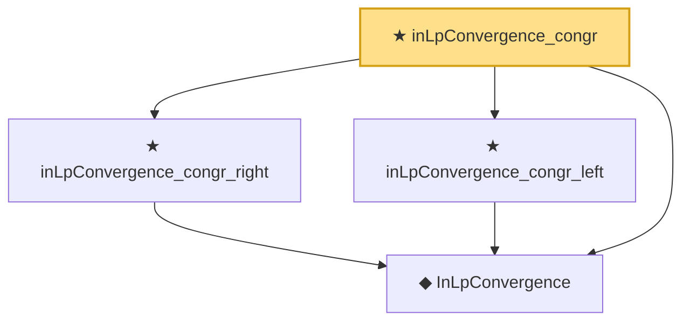

# Proof narrative — inLpConvergence_congr

Root: **inLpConvergence_congr** (theorem) `Statlib/StatFoundation/Convergence/AnalysisTools/ConvergenceModes.lean:935` · topic `StatFoundation`
Closure: 4 declarations across 1 files. Generated from `proof_graph.json` — no files were moved.

Reading order (foundations first, headline last):

  ◆ `InLpConvergence` — def · `Statlib/StatFoundation/Convergence/AnalysisTools/ConvergenceModes.lean:77`  _(also used by 66: tendstoInMeasure_of_inLpConvergence, inProbabilityConvergence_of_inLpConvergence, inLpConvergence_of_tendsto_eLpNorm, …)_
  ★ `inLpConvergence_congr_right` — theorem · `Statlib/StatFoundation/Convergence/AnalysisTools/ConvergenceModes.lean:921`
  ★ `inLpConvergence_congr_left` — theorem · `Statlib/StatFoundation/Convergence/AnalysisTools/ConvergenceModes.lean:907`
★ `inLpConvergence_congr` — theorem · `Statlib/StatFoundation/Convergence/AnalysisTools/ConvergenceModes.lean:935` **← headline**

## Dependency diagram

