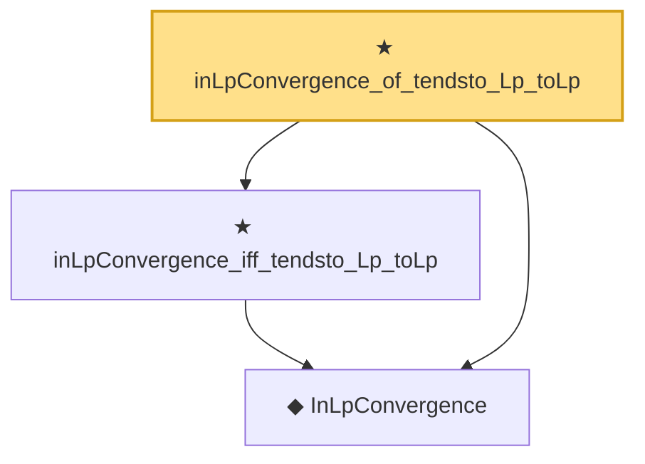

# Proof narrative — inLpConvergence_of_tendsto_Lp_toLp

Root: **inLpConvergence_of_tendsto_Lp_toLp** (theorem) `Statlib/StatFoundation/Convergence/AnalysisTools/ConvergenceModes.lean:1070` · topic `StatFoundation`
Closure: 3 declarations across 1 files. Generated from `proof_graph.json` — no files were moved.

Reading order (foundations first, headline last):

  ◆ `InLpConvergence` — def · `Statlib/StatFoundation/Convergence/AnalysisTools/ConvergenceModes.lean:77`  _(also used by 67: inLpConvergence_congr_left, inLpConvergence_congr_right, inLpConvergence_congr, …)_
  ★ `inLpConvergence_iff_tendsto_Lp_toLp` — theorem · `Statlib/StatFoundation/Convergence/AnalysisTools/ConvergenceModes.lean:1046`  _(also used by 1: tendsto_Lp_toLp_of_inLpConvergence)_
★ `inLpConvergence_of_tendsto_Lp_toLp` — theorem · `Statlib/StatFoundation/Convergence/AnalysisTools/ConvergenceModes.lean:1070` **← headline**

## Dependency diagram

