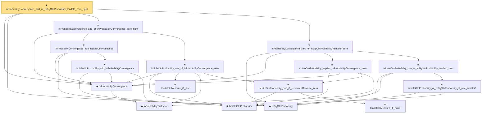

# Proof narrative — inProbabilityConvergence_add_of_isBigOInProbability_tendsto_zero_right

Root: **inProbabilityConvergence_add_of_isBigOInProbability_tendsto_zero_right** (theorem) `Statlib/StatFoundation/Convergence/AnalysisTools/StochasticOrder/ConvergenceBridges.lean:449` · topic `StatFoundation`
Closure: 16 declarations across 5 files. Generated from `proof_graph.json` — no files were moved.

Reading order (foundations first, headline last):

    ◆ `InProbabilityTailEvent` — def · `Statlib/StatFoundation/Convergence/AnalysisTools/ConvergenceModes.lean:46`  _(also used by 7: t_test_consistent, CompleteConvergence, inProbabilityConvergence_of_tendstoInMeasure, …)_
  ◆ `InProbabilityConvergence` — def · `Statlib/StatFoundation/Convergence/AnalysisTools/ConvergenceModes.lean:61`  _(also used by 68: t_test_consistent, tendstoInMeasure_of_inProbabilityConvergence, inProbabilityConvergence_of_tendstoInMeasure, …)_
  ◆ `IsBigOInProbability` — def · `Statlib/StatFoundation/Vocabulary/StochasticOrder.lean:48`  _(also used by 52: isBigOInProbability_add, isBigOInProbability_smul_rate, isBigOInProbability_mul_rate, …)_
      ◆ `IsLittleOInProbability` — def · `Statlib/StatFoundation/Vocabulary/StochasticOrder.lean:58`  _(also used by 44: isLittleOInProbability_add, isLittleOInProbability_smul_rate, isLittleOInProbability_mul_rate, …)_
      ★ `isLittleOInProbability_add_inProbabilityConvergence` — theorem · `Statlib/StatFoundation/Convergence/AnalysisTools/StochasticOrder/ConvergenceBridges.lean:112`  _(also used by 2: inProbabilityConvergence_add_of_inProbabilityConvergence_zero_left, inProbabilityConvergence_of_isLittleOInProbability_sub)_
    ★ `inProbabilityConvergence_add_isLittleOInProbability` — theorem · `Statlib/StatFoundation/Convergence/AnalysisTools/StochasticOrder/ConvergenceBridges.lean:170`
      ★ `tendstoInMeasure_iff_dist` — theorem · `Statlib/StatFoundation/Convergence/AnalysisTools/ConvergenceModes.lean:574`  _(also used by 5: tendstoInMeasure_of_inProbabilityConvergence, tendstoInMeasure_lipschitz, tendstoInMeasure_inv_of_ne_zero, …)_
        ★ `tendstoInMeasure_iff_norm` — theorem · `Statlib/StatFoundation/Convergence/AnalysisTools/ConvergenceModes.lean:584`  _(also used by 1: z_estimator_linearization_from_mvt)_
      ★ `isLittleOInProbability_one_iff_tendstoInMeasure_zero` — theorem · `Statlib/StatFoundation/Convergence/AnalysisTools/StochasticOrder/Basic.lean:201`  _(also used by 4: tendstoInDistribution_debiasedLasso_scaledCenteredFiniteCoordinate_of_linearScore_and_l1_rowApprox_real, tendstoInDistribution_debiasedLasso_scaledCenteredCoordinate_of_scoreCoordinate_and_l1_rowApprox_real, tendstoInMeasure_zero_of_isBigOInProbability_tendsto_zero, …)_
    ★ `isLittleOInProbability_one_of_inProbabilityConvergence_zero` — theorem · `Statlib/StatFoundation/Convergence/AnalysisTools/StochasticOrder/ConvergenceBridges.lean:82`  _(also used by 5: isLittleOInProbability_one_iff_inProbabilityConvergence_zero, inProbabilityConvergence_add_of_inProbabilityConvergence_zero_left, isLittleOInProbability_one_sub_of_inProbabilityConvergence, …)_
  ★ `inProbabilityConvergence_add_of_inProbabilityConvergence_zero_right` — theorem · `Statlib/StatFoundation/Convergence/AnalysisTools/StochasticOrder/ConvergenceBridges.lean:191`
    ★ `isLittleOInProbability_implies_inProbabilityConvergence_zero` — theorem · `Statlib/StatFoundation/Convergence/AnalysisTools/StochasticOrder/ConvergenceBridges.lean:17`  _(also used by 3: isLittleOInProbability_one_iff_inProbabilityConvergence_zero, inProbabilityConvergence_zero_of_isLittleOInProbability_rate_isBigO_one, z_estimator_linearization_from_mvt)_
      ★ `isLittleOInProbability_of_isBigOInProbability_of_rate_isLittleO` — theorem · `Statlib/StatFoundation/Convergence/AnalysisTools/StochasticOrder/RateRefinement.lean:15`
    ★ `isLittleOInProbability_one_of_isBigOInProbability_tendsto_zero` — theorem · `Statlib/StatFoundation/Convergence/AnalysisTools/StochasticOrder/RateRefinement.lean:62`  _(also used by 3: hasCoordinatewiseIsLittleOInProbability_debiasedLasso_scaledBiasRemainder_of_l1Error_and_rowApproxError_real, tendstoInMeasure_zero_of_isBigOInProbability_tendsto_zero, isBoundedInProbability_of_isBigOInProbability_tendsto_zero)_
  ★ `inProbabilityConvergence_zero_of_isBigOInProbability_tendsto_zero` — theorem · `Statlib/StatFoundation/Convergence/AnalysisTools/StochasticOrder/ConvergenceBridges.lean:415`  _(also used by 7: inProbabilityConvergence_add_of_isBigOInProbability_tendsto_zero_left, inProbabilityConvergence_sub_of_isBigOInProbability_tendsto_zero_left, inProbabilityConvergence_sub_of_isBigOInProbability_tendsto_zero_right, …)_
★ `inProbabilityConvergence_add_of_isBigOInProbability_tendsto_zero_right` — theorem · `Statlib/StatFoundation/Convergence/AnalysisTools/StochasticOrder/ConvergenceBridges.lean:449` **← headline**

## Dependency diagram

