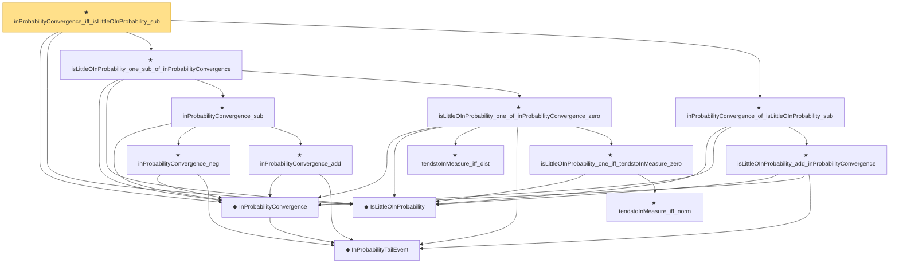

# Proof narrative — inProbabilityConvergence_iff_isLittleOInProbability_sub

Root: **inProbabilityConvergence_iff_isLittleOInProbability_sub** (theorem) `Statlib/StatFoundation/Convergence/AnalysisTools/StochasticOrder/ConvergenceBridges.lean:327` · topic `StatFoundation`
Closure: 14 declarations across 4 files. Generated from `proof_graph.json` — no files were moved.

Reading order (foundations first, headline last):

    ◆ `InProbabilityTailEvent` — def · `Statlib/StatFoundation/Convergence/AnalysisTools/ConvergenceModes.lean:46`  _(also used by 6: t_test_consistent, CompleteConvergence, inProbabilityConvergence_of_tendstoInMeasure, …)_
  ◆ `InProbabilityConvergence` — def · `Statlib/StatFoundation/Convergence/AnalysisTools/ConvergenceModes.lean:61`  _(also used by 67: t_test_consistent, tendstoInMeasure_of_inProbabilityConvergence, inProbabilityConvergence_of_tendstoInMeasure, …)_
  ◆ `IsLittleOInProbability` — def · `Statlib/StatFoundation/Vocabulary/StochasticOrder.lean:58`  _(also used by 45: isLittleOInProbability_add, isLittleOInProbability_smul_rate, isLittleOInProbability_mul_rate, …)_
      ★ `inProbabilityConvergence_neg` — theorem · `Statlib/StatFoundation/Convergence/AnalysisTools/StochasticOrder/ConvergenceBridges.lean:201`  _(also used by 1: z_estimator_linearization_from_mvt)_
      ★ `inProbabilityConvergence_add` — theorem · `Statlib/StatFoundation/Convergence/AnalysisTools/StochasticOrder/ConvergenceBridges.lean:218`  _(also used by 1: z_estimator_linearization_from_mvt)_
    ★ `inProbabilityConvergence_sub` — theorem · `Statlib/StatFoundation/Convergence/AnalysisTools/StochasticOrder/ConvergenceBridges.lean:284`  _(also used by 3: inProbabilityConvergence_sub_of_isBigOInProbability_tendsto_zero_left, inProbabilityConvergence_sub_of_isBigOInProbability_tendsto_zero_right, z_estimator_linearization_from_mvt)_
      ★ `tendstoInMeasure_iff_dist` — theorem · `Statlib/StatFoundation/Convergence/AnalysisTools/ConvergenceModes.lean:574`  _(also used by 5: tendstoInMeasure_of_inProbabilityConvergence, tendstoInMeasure_lipschitz, tendstoInMeasure_inv_of_ne_zero, …)_
        ★ `tendstoInMeasure_iff_norm` — theorem · `Statlib/StatFoundation/Convergence/AnalysisTools/ConvergenceModes.lean:584`  _(also used by 1: z_estimator_linearization_from_mvt)_
      ★ `isLittleOInProbability_one_iff_tendstoInMeasure_zero` — theorem · `Statlib/StatFoundation/Convergence/AnalysisTools/StochasticOrder/Basic.lean:201`  _(also used by 5: tendstoInDistribution_debiasedLasso_scaledCenteredFiniteCoordinate_of_linearScore_and_l1_rowApprox_real, tendstoInDistribution_debiasedLasso_scaledCenteredCoordinate_of_scoreCoordinate_and_l1_rowApprox_real, isLittleOInProbability_implies_inProbabilityConvergence_zero, …)_
    ★ `isLittleOInProbability_one_of_inProbabilityConvergence_zero` — theorem · `Statlib/StatFoundation/Convergence/AnalysisTools/StochasticOrder/ConvergenceBridges.lean:82`  _(also used by 5: isLittleOInProbability_one_iff_inProbabilityConvergence_zero, inProbabilityConvergence_add_of_inProbabilityConvergence_zero_left, inProbabilityConvergence_add_of_inProbabilityConvergence_zero_right, …)_
  ★ `isLittleOInProbability_one_sub_of_inProbabilityConvergence` — theorem · `Statlib/StatFoundation/Convergence/AnalysisTools/StochasticOrder/ConvergenceBridges.lean:298`
    ★ `isLittleOInProbability_add_inProbabilityConvergence` — theorem · `Statlib/StatFoundation/Convergence/AnalysisTools/StochasticOrder/ConvergenceBridges.lean:112`  _(also used by 2: inProbabilityConvergence_add_isLittleOInProbability, inProbabilityConvergence_add_of_inProbabilityConvergence_zero_left)_
  ★ `inProbabilityConvergence_of_isLittleOInProbability_sub` — theorem · `Statlib/StatFoundation/Convergence/AnalysisTools/StochasticOrder/ConvergenceBridges.lean:315`
★ `inProbabilityConvergence_iff_isLittleOInProbability_sub` — theorem · `Statlib/StatFoundation/Convergence/AnalysisTools/StochasticOrder/ConvergenceBridges.lean:327` **← headline**

## Dependency diagram

