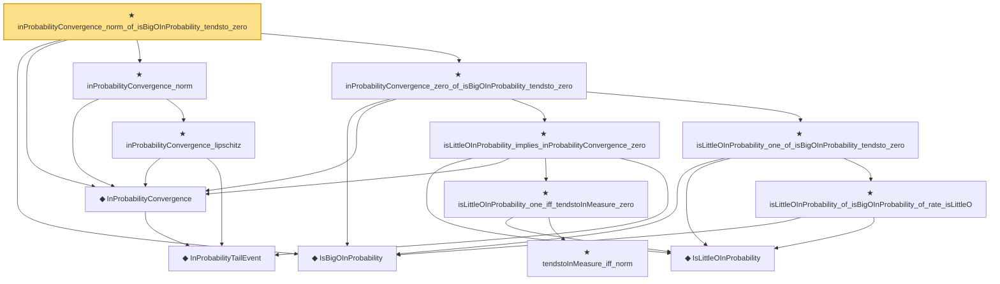

# Proof narrative — inProbabilityConvergence_norm_of_isBigOInProbability_tendsto_zero

Root: **inProbabilityConvergence_norm_of_isBigOInProbability_tendsto_zero** (theorem) `Statlib/StatFoundation/Convergence/AnalysisTools/StochasticOrder/ConvergenceBridges.lean:502` · topic `StatFoundation`
Closure: 13 declarations across 5 files. Generated from `proof_graph.json` — no files were moved.

Reading order (foundations first, headline last):

  ◆ `IsBigOInProbability` — def · `Statlib/StatFoundation/Vocabulary/StochasticOrder.lean:48`  _(also used by 52: isBigOInProbability_add, isBigOInProbability_smul_rate, isBigOInProbability_mul_rate, …)_
    ◆ `InProbabilityTailEvent` — def · `Statlib/StatFoundation/Convergence/AnalysisTools/ConvergenceModes.lean:46`  _(also used by 8: t_test_consistent, CompleteConvergence, inProbabilityConvergence_of_tendstoInMeasure, …)_
  ◆ `InProbabilityConvergence` — def · `Statlib/StatFoundation/Convergence/AnalysisTools/ConvergenceModes.lean:61`  _(also used by 70: t_test_consistent, tendstoInMeasure_of_inProbabilityConvergence, inProbabilityConvergence_of_tendstoInMeasure, …)_
    ★ `inProbabilityConvergence_lipschitz` — theorem · `Statlib/StatFoundation/Convergence/AnalysisTools/StochasticOrder/ConvergenceBridges.lean:345`  _(also used by 1: inProbabilityConvergence_continuousLinearMap)_
  ★ `inProbabilityConvergence_norm` — theorem · `Statlib/StatFoundation/Convergence/AnalysisTools/StochasticOrder/ConvergenceBridges.lean:394`
      ◆ `IsLittleOInProbability` — def · `Statlib/StatFoundation/Vocabulary/StochasticOrder.lean:58`  _(also used by 47: isLittleOInProbability_add, isLittleOInProbability_smul_rate, isLittleOInProbability_mul_rate, …)_
        ★ `tendstoInMeasure_iff_norm` — theorem · `Statlib/StatFoundation/Convergence/AnalysisTools/ConvergenceModes.lean:584`  _(also used by 1: z_estimator_linearization_from_mvt)_
      ★ `isLittleOInProbability_one_iff_tendstoInMeasure_zero` — theorem · `Statlib/StatFoundation/Convergence/AnalysisTools/StochasticOrder/Basic.lean:201`  _(also used by 5: tendstoInDistribution_debiasedLasso_scaledCenteredFiniteCoordinate_of_linearScore_and_l1_rowApprox_real, tendstoInDistribution_debiasedLasso_scaledCenteredCoordinate_of_scoreCoordinate_and_l1_rowApprox_real, isLittleOInProbability_one_of_inProbabilityConvergence_zero, …)_
    ★ `isLittleOInProbability_implies_inProbabilityConvergence_zero` — theorem · `Statlib/StatFoundation/Convergence/AnalysisTools/StochasticOrder/ConvergenceBridges.lean:17`  _(also used by 3: isLittleOInProbability_one_iff_inProbabilityConvergence_zero, inProbabilityConvergence_zero_of_isLittleOInProbability_rate_isBigO_one, z_estimator_linearization_from_mvt)_
      ★ `isLittleOInProbability_of_isBigOInProbability_of_rate_isLittleO` — theorem · `Statlib/StatFoundation/Convergence/AnalysisTools/StochasticOrder/RateRefinement.lean:15`
    ★ `isLittleOInProbability_one_of_isBigOInProbability_tendsto_zero` — theorem · `Statlib/StatFoundation/Convergence/AnalysisTools/StochasticOrder/RateRefinement.lean:62`  _(also used by 3: hasCoordinatewiseIsLittleOInProbability_debiasedLasso_scaledBiasRemainder_of_l1Error_and_rowApproxError_real, tendstoInMeasure_zero_of_isBigOInProbability_tendsto_zero, isBoundedInProbability_of_isBigOInProbability_tendsto_zero)_
  ★ `inProbabilityConvergence_zero_of_isBigOInProbability_tendsto_zero` — theorem · `Statlib/StatFoundation/Convergence/AnalysisTools/StochasticOrder/ConvergenceBridges.lean:415`  _(also used by 7: inProbabilityConvergence_add_of_isBigOInProbability_tendsto_zero_left, inProbabilityConvergence_add_of_isBigOInProbability_tendsto_zero_right, inProbabilityConvergence_sub_of_isBigOInProbability_tendsto_zero_left, …)_
★ `inProbabilityConvergence_norm_of_isBigOInProbability_tendsto_zero` — theorem · `Statlib/StatFoundation/Convergence/AnalysisTools/StochasticOrder/ConvergenceBridges.lean:502` **← headline**

## Dependency diagram

