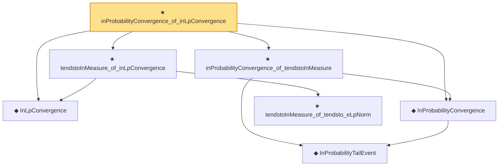

# Proof narrative — inProbabilityConvergence_of_inLpConvergence

Root: **inProbabilityConvergence_of_inLpConvergence** (theorem) `Statlib/StatFoundation/Convergence/AnalysisTools/ConvergenceModes.lean:957` · topic `StatFoundation`
Closure: 7 declarations across 1 files. Generated from `proof_graph.json` — no files were moved.

Reading order (foundations first, headline last):

  ◆ `InLpConvergence` — def · `Statlib/StatFoundation/Convergence/AnalysisTools/ConvergenceModes.lean:77`  _(also used by 67: inLpConvergence_congr_left, inLpConvergence_congr_right, inLpConvergence_congr, …)_
    ◆ `InProbabilityTailEvent` — def · `Statlib/StatFoundation/Convergence/AnalysisTools/ConvergenceModes.lean:46`  _(also used by 9: t_test_consistent, CompleteConvergence, as_implies_inProbability, …)_
  ◆ `InProbabilityConvergence` — def · `Statlib/StatFoundation/Convergence/AnalysisTools/ConvergenceModes.lean:61`  _(also used by 73: t_test_consistent, tendstoInMeasure_of_inProbabilityConvergence, inProbabilityConvergence_iff_tendstoInMeasure, …)_
  ★ `inProbabilityConvergence_of_tendstoInMeasure` — theorem · `Statlib/StatFoundation/Convergence/AnalysisTools/ConvergenceModes.lean:712`  _(also used by 8: inProbabilityConvergence_iff_tendstoInMeasure, inProbabilityConvergence_subseq, inProbabilityConvergence_congr_left, …)_
    ★ `tendstoInMeasure_of_tendsto_eLpNorm` — theorem · `Statlib/StatFoundation/Convergence/AnalysisTools/ConvergenceModes.lean:976`  _(also used by 3: ate_y1_eq, condExp_mul_indicator_eq_mul_condExp_of_condIndep, inProbabilityConvergence_of_tendsto_eLpNorm)_
  ★ `tendstoInMeasure_of_inLpConvergence` — theorem · `Statlib/StatFoundation/Convergence/AnalysisTools/ConvergenceModes.lean:946`
★ `inProbabilityConvergence_of_inLpConvergence` — theorem · `Statlib/StatFoundation/Convergence/AnalysisTools/ConvergenceModes.lean:957` **← headline**

## Dependency diagram

