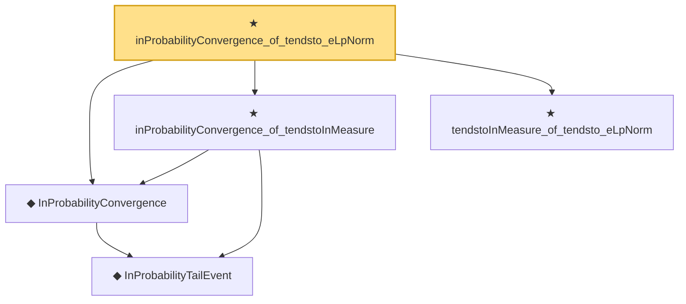

# Proof narrative — inProbabilityConvergence_of_tendsto_eLpNorm

Root: **inProbabilityConvergence_of_tendsto_eLpNorm** (theorem) `Statlib/StatFoundation/Convergence/AnalysisTools/ConvergenceModes.lean:988` · topic `StatFoundation`
Closure: 5 declarations across 1 files. Generated from `proof_graph.json` — no files were moved.

Reading order (foundations first, headline last):

    ◆ `InProbabilityTailEvent` — def · `Statlib/StatFoundation/Convergence/AnalysisTools/ConvergenceModes.lean:46`  _(also used by 9: t_test_consistent, CompleteConvergence, as_implies_inProbability, …)_
  ◆ `InProbabilityConvergence` — def · `Statlib/StatFoundation/Convergence/AnalysisTools/ConvergenceModes.lean:61`  _(also used by 73: t_test_consistent, tendstoInMeasure_of_inProbabilityConvergence, inProbabilityConvergence_iff_tendstoInMeasure, …)_
  ★ `inProbabilityConvergence_of_tendstoInMeasure` — theorem · `Statlib/StatFoundation/Convergence/AnalysisTools/ConvergenceModes.lean:712`  _(also used by 8: inProbabilityConvergence_iff_tendstoInMeasure, inProbabilityConvergence_subseq, inProbabilityConvergence_congr_left, …)_
  ★ `tendstoInMeasure_of_tendsto_eLpNorm` — theorem · `Statlib/StatFoundation/Convergence/AnalysisTools/ConvergenceModes.lean:976`  _(also used by 3: ate_y1_eq, condExp_mul_indicator_eq_mul_condExp_of_condIndep, tendstoInMeasure_of_inLpConvergence)_
★ `inProbabilityConvergence_of_tendsto_eLpNorm` — theorem · `Statlib/StatFoundation/Convergence/AnalysisTools/ConvergenceModes.lean:988` **← headline**

## Dependency diagram

