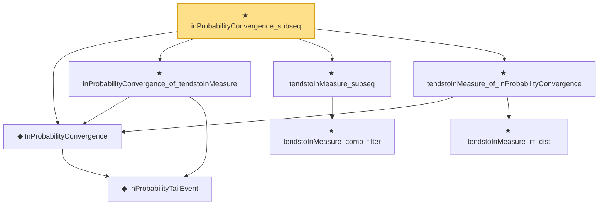

# Proof narrative — inProbabilityConvergence_subseq

Root: **inProbabilityConvergence_subseq** (theorem) `Statlib/StatFoundation/Convergence/AnalysisTools/ConvergenceModes.lean:848` · topic `StatFoundation`
Closure: 8 declarations across 1 files. Generated from `proof_graph.json` — no files were moved.

Reading order (foundations first, headline last):

    ◆ `InProbabilityTailEvent` — def · `Statlib/StatFoundation/Convergence/AnalysisTools/ConvergenceModes.lean:46`  _(also used by 9: t_test_consistent, CompleteConvergence, as_implies_inProbability, …)_
  ◆ `InProbabilityConvergence` — def · `Statlib/StatFoundation/Convergence/AnalysisTools/ConvergenceModes.lean:61`  _(also used by 72: t_test_consistent, inProbabilityConvergence_iff_tendstoInMeasure, inProbabilityConvergence_congr_left, …)_
  ★ `inProbabilityConvergence_of_tendstoInMeasure` — theorem · `Statlib/StatFoundation/Convergence/AnalysisTools/ConvergenceModes.lean:712`  _(also used by 8: inProbabilityConvergence_iff_tendstoInMeasure, inProbabilityConvergence_congr_left, inProbabilityConvergence_congr_right, …)_
    ★ `tendstoInMeasure_comp_filter` — theorem · `Statlib/StatFoundation/Convergence/AnalysisTools/ConvergenceModes.lean:813`
  ★ `tendstoInMeasure_subseq` — theorem · `Statlib/StatFoundation/Convergence/AnalysisTools/ConvergenceModes.lean:822`
    ★ `tendstoInMeasure_iff_dist` — theorem · `Statlib/StatFoundation/Convergence/AnalysisTools/ConvergenceModes.lean:574`  _(also used by 5: tendstoInMeasure_lipschitz, tendstoInMeasure_inv_of_ne_zero, tendstoInMeasure_const_of_rescaled_tendstoInDistribution, …)_
  ★ `tendstoInMeasure_of_inProbabilityConvergence` — theorem · `Statlib/StatFoundation/Convergence/AnalysisTools/ConvergenceModes.lean:696`  _(also used by 10: inProbabilityConvergence_iff_tendstoInMeasure, inProbabilityConvergence_congr_left, inProbabilityConvergence_congr_right, …)_
★ `inProbabilityConvergence_subseq` — theorem · `Statlib/StatFoundation/Convergence/AnalysisTools/ConvergenceModes.lean:848` **← headline**

## Dependency diagram

