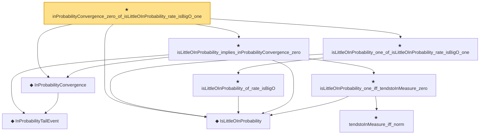

# Proof narrative — inProbabilityConvergence_zero_of_isLittleOInProbability_rate_isBigO_one

Root: **inProbabilityConvergence_zero_of_isLittleOInProbability_rate_isBigO_one** (theorem) `Statlib/StatFoundation/Convergence/AnalysisTools/StochasticOrder/ConvergenceBridges.lean:546` · topic `StatFoundation`
Closure: 9 declarations across 5 files. Generated from `proof_graph.json` — no files were moved.

Reading order (foundations first, headline last):

  ◆ `IsLittleOInProbability` — def · `Statlib/StatFoundation/Vocabulary/StochasticOrder.lean:58`  _(also used by 46: isLittleOInProbability_add, isLittleOInProbability_smul_rate, isLittleOInProbability_mul_rate, …)_
    ◆ `InProbabilityTailEvent` — def · `Statlib/StatFoundation/Convergence/AnalysisTools/ConvergenceModes.lean:46`  _(also used by 9: t_test_consistent, CompleteConvergence, inProbabilityConvergence_of_tendstoInMeasure, …)_
  ◆ `InProbabilityConvergence` — def · `Statlib/StatFoundation/Convergence/AnalysisTools/ConvergenceModes.lean:61`  _(also used by 73: t_test_consistent, tendstoInMeasure_of_inProbabilityConvergence, inProbabilityConvergence_of_tendstoInMeasure, …)_
      ★ `tendstoInMeasure_iff_norm` — theorem · `Statlib/StatFoundation/Convergence/AnalysisTools/ConvergenceModes.lean:584`  _(also used by 1: z_estimator_linearization_from_mvt)_
    ★ `isLittleOInProbability_one_iff_tendstoInMeasure_zero` — theorem · `Statlib/StatFoundation/Convergence/AnalysisTools/StochasticOrder/Basic.lean:201`  _(also used by 5: tendstoInDistribution_debiasedLasso_scaledCenteredFiniteCoordinate_of_linearScore_and_l1_rowApprox_real, tendstoInDistribution_debiasedLasso_scaledCenteredCoordinate_of_scoreCoordinate_and_l1_rowApprox_real, isLittleOInProbability_one_of_inProbabilityConvergence_zero, …)_
  ★ `isLittleOInProbability_implies_inProbabilityConvergence_zero` — theorem · `Statlib/StatFoundation/Convergence/AnalysisTools/StochasticOrder/ConvergenceBridges.lean:17`  _(also used by 3: isLittleOInProbability_one_iff_inProbabilityConvergence_zero, inProbabilityConvergence_zero_of_isBigOInProbability_tendsto_zero, z_estimator_linearization_from_mvt)_
    ★ `isLittleOInProbability_of_rate_isBigO` — theorem · `Statlib/StatFoundation/Convergence/AnalysisTools/StochasticOrder/RateLittle.lean:12`
  ★ `isLittleOInProbability_one_of_isLittleOInProbability_rate_isBigO_one` — theorem · `Statlib/StatFoundation/Convergence/AnalysisTools/StochasticOrder/ConvergenceBridges.lean:525`  _(also used by 2: tendstoInMeasure_zero_of_isLittleOInProbability_rate_isBigO_one, isBoundedInProbability_of_isLittleOInProbability_rate_isBigO_one)_
★ `inProbabilityConvergence_zero_of_isLittleOInProbability_rate_isBigO_one` — theorem · `Statlib/StatFoundation/Convergence/AnalysisTools/StochasticOrder/ConvergenceBridges.lean:546` **← headline**

## Dependency diagram

