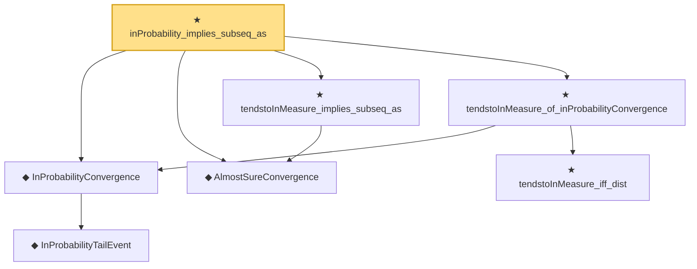

# Proof narrative — inProbability_implies_subseq_as

Root: **inProbability_implies_subseq_as** (theorem) `Statlib/StatFoundation/Convergence/AnalysisTools/ConvergenceModes.lean:1143` · topic `StatFoundation`
Closure: 7 declarations across 1 files. Generated from `proof_graph.json` — no files were moved.

Reading order (foundations first, headline last):

    ◆ `InProbabilityTailEvent` — def · `Statlib/StatFoundation/Convergence/AnalysisTools/ConvergenceModes.lean:46`  _(also used by 10: t_test_consistent, CompleteConvergence, inProbabilityConvergence_of_tendstoInMeasure, …)_
  ◆ `InProbabilityConvergence` — def · `Statlib/StatFoundation/Convergence/AnalysisTools/ConvergenceModes.lean:61`  _(also used by 73: t_test_consistent, inProbabilityConvergence_of_tendstoInMeasure, inProbabilityConvergence_iff_tendstoInMeasure, …)_
  ◆ `AlmostSureConvergence` — def · `Statlib/StatFoundation/Convergence/AnalysisTools/ConvergenceModes.lean:35`  _(also used by 2: as_implies_inProbability, complete_implies_as)_
  ★ `tendstoInMeasure_implies_subseq_as` — theorem · `Statlib/StatFoundation/Convergence/AnalysisTools/ConvergenceModes.lean:738`
    ★ `tendstoInMeasure_iff_dist` — theorem · `Statlib/StatFoundation/Convergence/AnalysisTools/ConvergenceModes.lean:574`  _(also used by 5: tendstoInMeasure_lipschitz, tendstoInMeasure_inv_of_ne_zero, tendstoInMeasure_const_of_rescaled_tendstoInDistribution, …)_
  ★ `tendstoInMeasure_of_inProbabilityConvergence` — theorem · `Statlib/StatFoundation/Convergence/AnalysisTools/ConvergenceModes.lean:696`  _(also used by 10: inProbabilityConvergence_iff_tendstoInMeasure, inProbabilityConvergence_subseq, inProbabilityConvergence_congr_left, …)_
★ `inProbability_implies_subseq_as` — theorem · `Statlib/StatFoundation/Convergence/AnalysisTools/ConvergenceModes.lean:1143` **← headline**

## Dependency diagram

