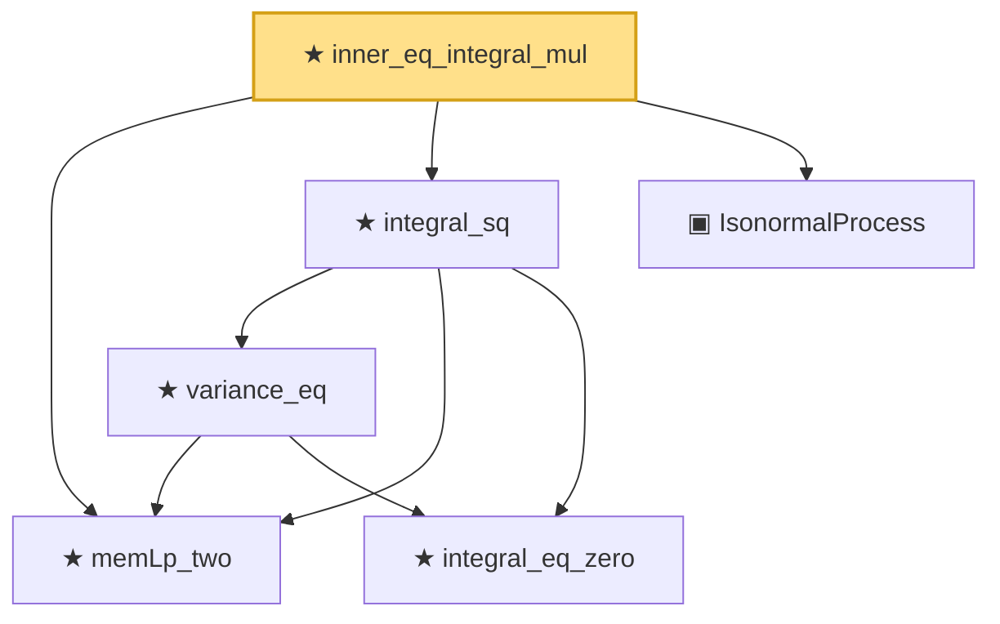

# Proof narrative — inner_eq_integral_mul

Root: **inner_eq_integral_mul** (theorem) `Statlib/StatFoundation/RandomVariable/Gaussian/HilbertSpace.lean:115` · topic `StatFoundation`
Closure: 6 declarations across 1 files. Generated from `proof_graph.json` — no files were moved.

Reading order (foundations first, headline last):

  ★ `memLp_two` — theorem · `Statlib/StatFoundation/RandomVariable/Gaussian/HilbertSpace.lean:78`  _(also used by 1: HasUnitVariance)_
    ★ `integral_eq_zero` — theorem · `Statlib/StatFoundation/RandomVariable/Gaussian/HilbertSpace.lean:66`
    ★ `variance_eq` — theorem · `Statlib/StatFoundation/RandomVariable/Gaussian/HilbertSpace.lean:87`
  ★ `integral_sq` — private theorem · `Statlib/StatFoundation/RandomVariable/Gaussian/HilbertSpace.lean:107`
  ▣ `IsonormalProcess` — structure · `Statlib/StatFoundation/RandomVariable/Gaussian/HilbertSpace.lean:47`
★ `inner_eq_integral_mul` — theorem · `Statlib/StatFoundation/RandomVariable/Gaussian/HilbertSpace.lean:115` **← headline**

## Dependency diagram

